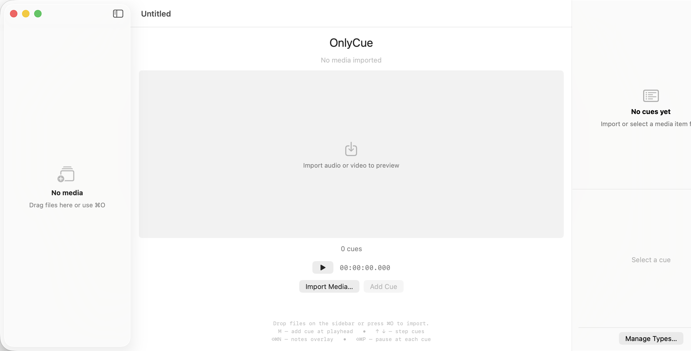
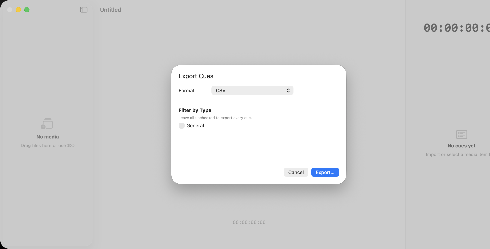
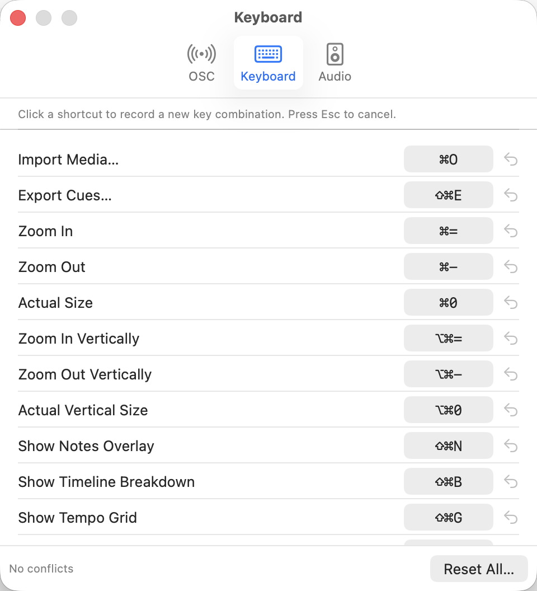
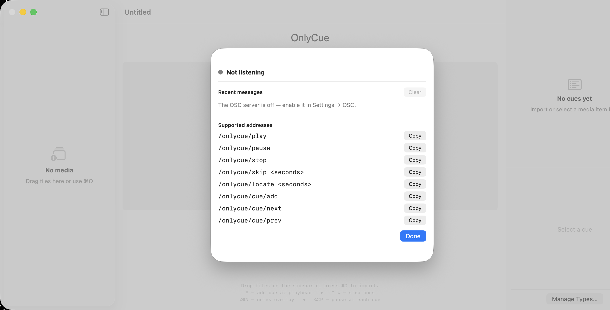

# OnlyCue

A native macOS application for lighting designers and show programmers, inspired by [CuePoints](https://cuepoints.com/). Import a media file (audio or video), preview it, and lay out a **cue list** — an ordered set of named, color-coded markers anchored to timestamps — to plan and communicate timing for live shows or TV.

## Table of Contents

- [OnlyCue](#onlycue)
  - [Table of Contents](#table-of-contents)
  - [Screenshots](#screenshots)
  - [Install](#install)
  - [Status](#status)
    - [Current release](#current-release)
    - [Shipped beyond MVP (on `dev`)](#shipped-beyond-mvp-on-dev)
    - [In progress / next](#in-progress--next)
  - [UI sections (canonical names)](#ui-sections-canonical-names)
    - [Document Window](#document-window)
    - [Auxiliary surfaces](#auxiliary-surfaces)
    - [Settings tabs](#settings-tabs)
  - [Build](#build)
    - [When to re-run xcodegen / clean the build folder](#when-to-re-run-xcodegen--clean-the-build-folder)
    - [Run tests and lint locally](#run-tests-and-lint-locally)
  - [Documents](#documents)
  - [Stack at a glance](#stack-at-a-glance)
  - [Reference](#reference)

## Screenshots

Document window (fresh, untitled) — media preview area, transport bar, and the empty cue list:


<!-- Regenerate: xcodebuild test -project OnlyCue.xcodeproj -scheme OnlyCue -destination 'platform=macOS' -only-testing:OnlyCueUITests/TransportBarScreenshotTests, then copy transport-bar-baseline.png from the runner tmp dir. TODO: a media-loaded variant needs a new UI test + media fixture. -->


Export Cues sheet (`⇧⌘E`) — format picker and per-cue-type filter:



OSC settings (Settings → OSC) — enable the receive-only OSC server and pick a listen port:



OSC Monitor (`Tools → OSC Monitor…`) — live message tail and copyable address list:



## Install

Download the latest DMG from the [releases page](https://github.com/chienchuanw/only-cue/releases) and follow these steps:

1. Open `OnlyCue-x.y.z.dmg` and drag **OnlyCue** into your Applications folder.
2. Eject the DMG.
3. **First launch:** in Finder, right-click (or Control-click) `OnlyCue.app` and choose **Open**. macOS will warn that the developer can't be verified — click **Open** anyway. Future launches are silent.

Why the right-click step? OnlyCue is currently distributed without a paid Apple Developer ID signature. The `.app` is ad-hoc signed and unmodified; right-clicking → Open is the standard macOS bypass. If you'd rather avoid that step, [build from source](#build).

System requirements: macOS 14 (Sonoma) or later, Apple silicon or Intel.

## Status

### Current release

**MVP shipped — [v0.1.0](https://github.com/chienchuanw/only-cue/releases/tag/v0.1.0).** All 13 MVP issues closed via PRs [#14–#26](https://github.com/chienchuanw/only-cue/pulls?q=is%3Apr+is%3Amerged).

### Shipped beyond MVP (on `dev`)

| Area | What's in |
|---|---|
| **Post-MVP enhancements** | Multi-media items per project (schema v2 with auto-migration, sidebar with drag-reorder, multi-file picker, per-item cues, background waveform prewarm); waveform strip beneath video imports; draggable playhead with HH:MM:SS scrub label; horizontal waveform zoom (1×–16× via trackpad pinch and `⌘=`/`⌘-`/`⌘0`) with auto-follow during playback. |
| **Epic [#32](https://github.com/chienchuanw/only-cue/issues/32) — cue model rework** | **Complete.** First-class `CuePointType`, user-facing `Cue.cueNumber` with mid-point insertion, required `Cue.fadeTime` (split-fade syntax), cue inspector pane, "Manage Types…" sheet, number-key cue creation. Schema settled at v6 with deterministic migrations from v1+. |
| **Epic [#33](https://github.com/chienchuanw/only-cue/issues/33) — LTC generation + audio routing** | **Complete.** Generates SMPTE Linear Timecode synced to playback (24 / 25 / 30 ND / 30 DF), routable to a chosen Core Audio output. `Settings → Audio` has a master **"Enable LTC output"** toggle (off by default); when on, pick the output device and assign each channel a role — LTC, Track L, Track R, or Silent. While LTC runs with Track channels assigned and media loaded, the media's audio is replayed through the LTC engine onto those channels and `AVPlayer` is muted, so the routed device carries only what the engine produces — the LTC channel is never summed with program audio. Imported files already striped with LTC drive the transport's SMPTE readout; we generate and display timecode, we don't chase it. The live audio/device path is verified by running the app against an interface (the pure parts are unit-tested). ADR-019. |
| **Epic [#34](https://github.com/chienchuanw/only-cue/issues/34) — console export** | **Complete.** File → Export Cues… (`⇧⌘E`) → sheet with a format picker (CSV / TSV / grandMA3 / grandMA2 — the last two best-effort, no authoritative format docs in-repo) and per-`CuePointType` filter. Two orthogonal pure functions (`CueExportFilter` + `CueCSVExporter`) plus an AppKit save action; golden-file tests pin all four targets. ADR-013/014. |
| **Epic [#35](https://github.com/chienchuanw/only-cue/issues/35) — OSC remote control** | **Complete.** Receive-only OSC server (UDP, `Network.framework`, hand-rolled OSC 1.0 parser — no dependency); Settings → OSC enable toggle + listen port; transport (`/onlycue/play\|pause\|stop\|skip\|locate`) and cue (`/cue/add\|next\|prev`) commands; `Tools → OSC Monitor…` sheet with a live message tail + copyable address list; Bitfocus Companion / StreamDeck / grandMA3 macro reference in [`docs/osc-companion-ma3.md`](docs/osc-companion-ma3.md). Per-document server (one document responds — ADR-016). |
| **Epic [#36](https://github.com/chienchuanw/only-cue/issues/36) — timeline UX polish** | **In progress.** ↑/↓ keyboard step to prev/next cue; ⌘⌥=/⌘⌥-/⌘⌥0 vertical waveform zoom; single hover-revealed magnifier on the right edge for two-axis click-and-drag zoom (Shift-locks to dominant axis, double-click resets both); `S` snaps the selected cue to the playhead; ⌥←/⌥→ nudge it by a configurable step; `⌘D` duplicates the cue at the playhead. Waveform gain control and the Cmd/Shift multi-select model still pending. |
| **Epic [#37](https://github.com/chienchuanw/only-cue/issues/37) — timeline breakdown view** | **Complete.** `View → Show Timeline Breakdown` (`⇧⌘B`) swaps the preview's timeline for one lane per visible `CuePointType` — each with that Type's markers, a hide button, and a playhead line spanning all lanes; "+N hidden lanes" restores hidden ones. Lane visibility (`CuePointType.isVisible`) persists in `.cuelist` with no schema bump (ADR-017). Layout covered by `TimelineBreakdownLayout(Fidelity)Tests` + `CueCommandsVisibilityTests` (incl. a v3-migrated `.cuelist` fixture); a media-loaded UI screenshot fixture remains the one deferred item. |
| **Epic [#38](https://github.com/chienchuanw/only-cue/issues/38) — notes overlay** | **In progress.** HUD-style overlay rendering the active cue's notes on top of the preview; Tools-menu appearance sheet customising position, font scale (0.75×–3×), text color, optional solid background, optional cue-number prefix; restore-defaults button. |
| **Epic [#40](https://github.com/chienchuanw/only-cue/issues/40) — custom keyboard shortcuts** | **Complete.** Settings → Keyboard tab lets you rebind any command — menu items *and* the document-window keys (`m` add cue, `0`–`9` cue-type hotkeys, Space, ←→ jump, ↑↓ step cues) — click a row, press a new chord, Esc cancels; per-row reset-to-default, conflict ⚠︎ (advisory — duplicates allowed), Reset All. The keymap is a sparse, forward-tolerant JSON object under `keymap.v1` (`KeymapStore`); `AppCommands` / `DocumentView` / the on-screen cheat-sheet all read it; defaults equal the prior hardcoded shortcuts (ADR-018). |
| **Epic [#39](https://github.com/chienchuanw/only-cue/issues/39) — templates** | **Complete.** Save the project's `CuePointType` set as a `.cuelist-template` under `~/Documents/OnlyCue/Templates/`; File → Load Template… merges a template into the open project (append + fresh UUIDs so existing cues' `typeID` references never break — ADR-015); File → New from Template… starts a new document pre-loaded with a template's Type set. |
| **Epic [#231](https://github.com/chienchuanw/only-cue/issues/231) — per-media LTC** | **Complete.** Per-`MediaItem` start timecode and mute flag (schema v10 with deterministic migration from v9); `LTCStrip` rendered in the main pane when LTC routing is enabled, with a per-clip mute control and a timecode ruler; per-media TC editor in the sidebar plus a project-wide Timecode Settings sheet. PRs [#238–#243](https://github.com/chienchuanw/only-cue/pulls?q=is%3Apr+is%3Amerged+238..243). |
| **Tempo (cue-anchored)** | **Complete.** Tempo is anchored to cues, not stored as a separate map: each `Cue` carries an optional `bpm` and `beatsPerBar`, and `DerivedTempoGrid` derives beat / bar lines from the cue sequence at render time. Per-cue tempo inspector with a "Detect" button (`SpectralFluxTempoAnalyzer` over the audio span up to the next tempo-bearing cue); optional BPM column in the cue list; the standalone TempoMap, Tempo Map sheet, and auto-cue-on-grid menu items were removed in favor of this simpler model. Schema settled at v11 with migrations from v10. Supersedes the earlier `TempoMap` work from epic #199. |
| **Main-view polish** | **Complete.** Rename to "Only Cue" in the main view, decluttered layout, hi-res waveform (12k peaks), smooth playhead interpolation, click-to-seek anywhere on the waveform, and a fixed playhead time-label clipping bug. PRs #221–#228. |
| **Stand-alone leaves** | Cue inspector commits drafts on outside-click (window-scoped `NSEvent` monitor); File → Import Media… menu entry with ⌘O (canonical menu owner); ⇧⌘P "pause at each cue" mode; ⇧⌘N notes-overlay toggle; clickable empty-preview placeholder; manual cue numbering (`CueNumberValidator`, schema v8→v9). |
| **Release pipeline** | Self-serve: `bash scripts/build-release.sh && bash scripts/make-dmg.sh` produces a drag-installable DMG. Default `RELEASE_MODE=unsigned` is free-tier-friendly (ad-hoc signed). `RELEASE_MODE=signed` opt-in for Developer ID + notarization once on a paid Apple Developer Program. Procedure in [`docs/release.md`](docs/release.md). |

### In progress / next

- **Phase 2 — Pro handoff** — nine epics filed; #32, #33, #34, #35, #37, #39 and #40 complete; #36 and #38 in flight.
- **Live status** — [`docs/task_plan.md`](docs/task_plan.md) is the source of truth for what's open / in flight.
- **Append-only history** — [`docs/progress.md`](docs/progress.md) carries the per-PR narrative with rationale for every load-bearing decision.
- **Issue board** — [github.com/chienchuanw/only-cue/issues](https://github.com/chienchuanw/only-cue/issues).

## UI sections (canonical names)

These are the stable names to use in specs, issues, PRs, design docs, and verification scripts when referring to a part of the UI. The Swift type implementing each section is in parentheses; the accessibility identifier (where one exists) is in `code` so UI tests can target it directly.

### Document Window

The top-level per-`.cuelist` window. A three-pane `NavigationSplitView` with a stacked center column.

- **Media Library Sidebar** (`ItemListPane`) — left column. The list of `MediaItem`s in the project, with drag-reorder, multi-file picker entry, the per-item TC editor row (`MediaTimecodeRow`), and drop targets for new media. Row view: `ItemRowView`.
- **Main Pane** (`DocumentView.mainPane`) — center column. Stacks the following from top to bottom:
  - **Preview Pane** (`PreviewPane`, ID `previewPane`) — video surface or audio waveform display.
    - **Video Surface** (`AVPlayerLayerView`, ID `videoPreview`) — present only when the active item is a video.
    - **Timeline Strip** — either the **Waveform View** (`WaveformContainer` / `WaveformView`, IDs `videoWaveform` / `audioWaveform`) with cue markers and the draggable **Playhead Overlay** (`PlayheadOverlay`), or the **Timeline Breakdown** (`TimelineBreakdownView`, ID `timelineBreakdownArea`) when `View → Show Timeline Breakdown` is on. The waveform is overlaid by **Cue Markers** (`CueMarkersOverlay`), the **Tempo Grid Overlay** (`TempoGridOverlay`) when enabled, and the **Waveform Zoom Magnifier** (`WaveformZoomMagnifier`) on hover.
    - **Notes Overlay** (`NotesOverlayView`) — HUD-style cue-notes overlay rendered on top of the preview when `⇧⌘N` is on.
    - **Empty Preview Placeholder** (`DocumentEmptyState`, ID `emptyPreview`) — shown when no media is loaded; clickable.
  - **LTC Strip** (`LTCStrip`) — per-clip timecode ruler with a mute button. Visible only when LTC routing is enabled and a media item is loaded (per-media LTC, epic #231).
  - **Transport Bar** (`TransportBar`) — play / pause, scrub bar, HH:MM:SS readout, SMPTE readout (when LTC striping is detected on the active media), and prev / next cue buttons.
  - **Add Cue Button** (ID `addCueButton`) — explicit button below the transport bar; the `m` shortcut also fires this.
- **Cue Inspector Pane** (`CueListPane`, ID `cueListPane`) — right inspector. A `VSplitView` containing:
  - **Cue List** — filterable list of cues for the active item; rows are `CueRowView`. Includes the optional **BPM Column** (cue-anchored tempo). When no cues exist, shows the **Cue List Empty State**.
  - **Cue Inspector** (`CueInspectorView`) — details for the single selected cue: name, time, fade time, type, cue number, color, notes, and the **Tempo Group** (`CueInspectorView+Tempo`) with BPM / beats-per-bar fields and the Detect button.

### Auxiliary surfaces

Sheets, panels, and overlays that float over (or replace) the Document Window:

- **First Launch Sheet** (`FirstLaunchSheet`) — one-time welcome.
- **Export Cues Sheet** (`ExportSheet`, via `ExportSheetPresenter`) — `File → Export Cues…` (`⇧⌘E`).
- **Timecode Settings Sheet** (`TimecodeSettingsSheet`) — project-wide framerate and start TC.
- **Type Management Sheet** (`TypeManagementSheet`) — `CuePointType` editor.
- **Notes Overlay Appearance Sheet** (`NotesOverlayPreferencesSheet`) — overlay position / font / color.
- **OSC Monitor Sheet** (`OSCMonitorView`) — `Tools → OSC Monitor…`.
- **Document Shortcut Hints** (`DocumentShortcutHints`) — on-screen cheat-sheet.

### Settings tabs

The app's Settings window (`⌘,`) hosts these tabs as siblings:

- **Audio** (`AudioSettingsView`) — master LTC enable toggle and per-channel role routing.
- **OSC** (`OSCSettingsView`) — receive-only OSC server enable + listen port.
- **Keyboard** (`KeyboardSettingsView`) — rebind any command, per-row reset, Reset All.

When adding a new UI surface, give it a canonical name here in the same PR — specs and verification scripts reference these names rather than file paths.

## Build

```bash
brew install xcodegen swiftlint   # one-time
xcodegen generate                  # produces OnlyCue.xcodeproj from project.yml
open OnlyCue.xcodeproj
```

`OnlyCue.xcodeproj/` is generated and gitignored — `project.yml` is the source of truth.

### When to re-run xcodegen / clean the build folder

- **Re-run `xcodegen generate`** whenever `project.yml`, `Info.plist`, or the source folder structure changes (new top-level folder under `OnlyCue/`, new target, new pre-build script). Pulling a branch that touched any of those counts.
- **`⌘⇧K` (Clean Build Folder)** in Xcode after switching branches that changed Swift concurrency annotations or other compile-time invariants — Xcode's incremental build sometimes hangs on stale bitcode and surfaces it as a confusing build error (e.g., a Swift 6 `@MainActor` error on code that has already been fixed).
- **`⌘⇧⌥K` (Delete Derived Data)** if `⌘⇧K` doesn't clear the issue. Slower (full rebuild after) but resolves persistent stale-cache errors.

### Run tests and lint locally

```bash
xcodebuild test -project OnlyCue.xcodeproj -scheme OnlyCue -destination 'platform=macOS'
swiftlint --strict
```

## Documents

Read in this order:

1. [`docs/vision.md`](docs/vision.md) — what we're building and for whom
2. [`docs/mvp-scope.md`](docs/mvp-scope.md) — what's in and out for v1
3. [`docs/architecture.md`](docs/architecture.md) — modules, layout, key APIs
4. [`docs/data-model.md`](docs/data-model.md) — `ProjectModel`, `Cue`, file format
5. [`docs/build-sequence.md`](docs/build-sequence.md) — phased build order
6. [`docs/verification.md`](docs/verification.md) — how to know it works
7. [`docs/roadmap.md`](docs/roadmap.md) — phase 2+ and our differentiator
8. [`docs/decisions.md`](docs/decisions.md) — ADR log of locked choices
9. [`docs/task_plan.md`](docs/task_plan.md) — live phase tracker
10. [`docs/progress.md`](docs/progress.md) — append-only per-PR narrative

## Stack at a glance

| | |
|---|---|
| Language | Swift 5.10+ |
| UI | SwiftUI (`@Observable`, `DocumentGroup`) |
| Media | AVFoundation (`AVPlayer`, `AVAssetReader`) |
| Min OS | macOS 14 (Sonoma) |
| Project file | `.cuelist` (JSON, schema v11) |
| Distribution | Ad-hoc signed DMG (Developer ID + notarization opt-in) |

## Reference

- CuePoints (the inspiration): https://cuepoints.com/
