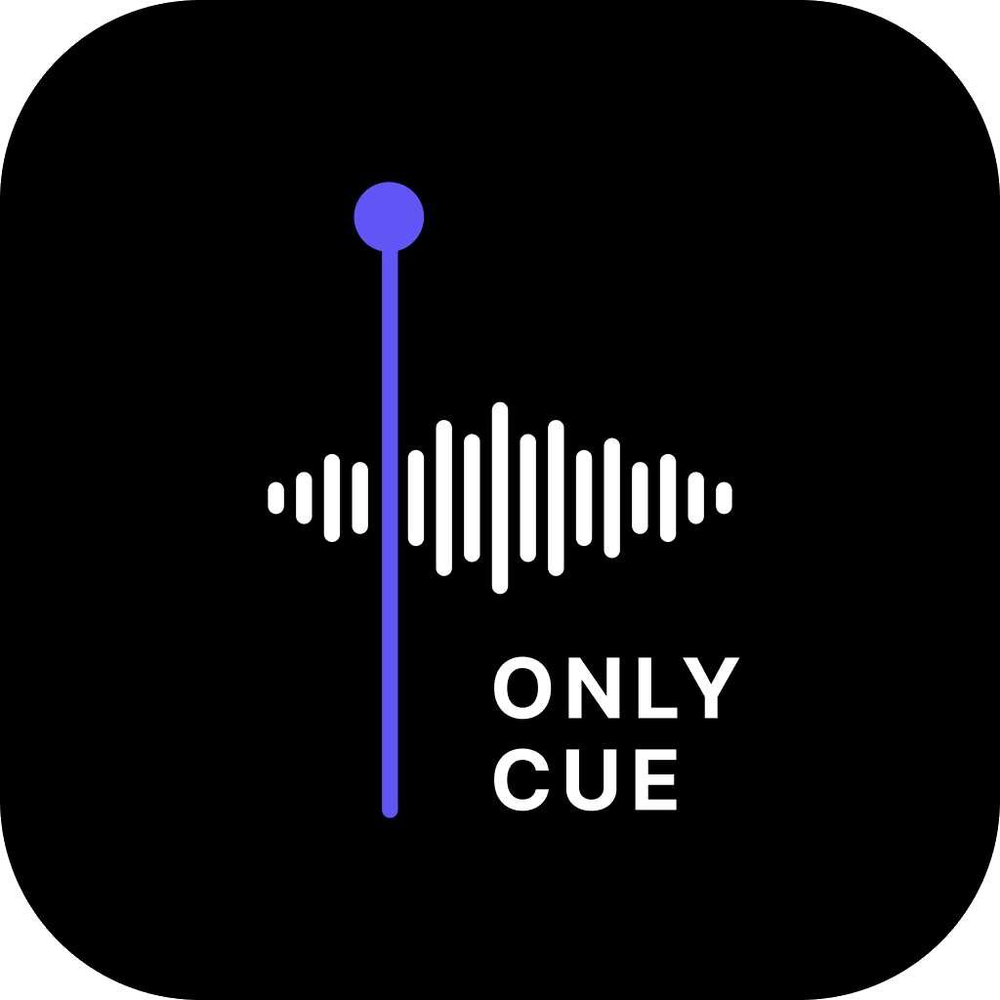

<div align="center">



# OnlyCue

**Native macOS app for lighting designers — plan cue lists against media.**

Import an audio or video file, preview it, and lay out a cue list: an ordered set of named, numbered, color-coded markers anchored to timestamps — to plan and communicate timing for live shows and TV.

[](https://github.com/chienchuanw/only-cue/releases/latest)
[](https://github.com/chienchuanw/only-cue/releases)
[](https://github.com/chienchuanw/only-cue/actions/workflows/ci.yml)


[](LICENSE)

[**Website**](https://onlycue.chienchuanw.com/) · [**Download**](https://github.com/chienchuanw/only-cue/releases/latest) · [**Documentation**](docs/) · [**Design system**](https://www.figma.com/design/NhH2957iKQ8b581x3gI3Wk/OnlyCue-Design-System)


</div>

## Table of Contents

- [Overview](#overview)
- [Features](#features)
- [Install](#install)
- [Build from source](#build-from-source)
- [Tech stack](#tech-stack)
- [Status](#status)
- [Documentation](#documentation)
- [Design](#design)
- [License](#license)
- [Acknowledgements](#acknowledgements)

## Overview

OnlyCue is a document-based macOS app for lighting designers and show programmers, inspired by [CuePoints](https://cuepoints.com/). You work against the media itself — a waveform or video timeline — dropping cues where they need to land, then hand the timing off to a console or a remote operator.

It is built for real show-control workflows: SMPTE linear timecode generation and routing, MIDI Timecode output, grandMA2 push, OSC and MIDI remote control, and console-ready cue exports. The main document window is a dark, design-token-driven surface kept 1:1 with a Figma design system.

## Features

**Cue planning**
- Named, numbered, color-coded cue markers with first-class cue types and per-type filtering.
- Inline row editing (number / name / fade); type, notes, and tempo via right-click sheets.
- Cue / Lyric / Show editor modes — Show mode is a read-only performance state; Lyric mode adds a drag-to-retime lyrics lane.

**Media & waveform**
- Audio and video import, multiple media items per project with drag-reorder.
- Color-tag any clip from its right-click menu — a leading stripe in the media panel, so a long list can be grouped at a glance.
- Dual-envelope waveform (filled RMS body + peak outline) that streams in progressively for large files, with click-to-seek, a draggable playhead, and horizontal zoom to 64× with auto-follow during playback.
- Music-only playback for files striped with timecode, plus an opt-in Split Channels view.

**Timecode & tempo**
- SMPTE Linear Timecode generation (24 / 25 / 30 ND / 30 DF) routed to a chosen Core Audio output, with per-channel role assignment.
- MIDI Timecode (MTC) output to any CoreMIDI destination, independent of LTC — quarter-frame stream while playing, Full Frame on locate (including while paused), plus a test burst to prove the rig at setup.
- Per-media start timecode; reads LTC striped onto imported audio.
- Cue-anchored tempo with a derived beat grid and per-cue tempo detection.

**Show control & export**

  

- Receive-only OSC server for transport and cue GO ([`docs/osc-companion-ma3.md`](docs/osc-companion-ma3.md) covers Bitfocus Companion / StreamDeck / grandMA3).
- MIDI-learn binding of notes/CC to GO / Stop.
- grandMA2 push: a live telnet Send to grandMA2, and an exportable `.lua` plugin.
- Console cue export (CSV / TSV / grandMA2 / grandMA3) with a per-type filter.

  

**Workflow**
- Encrypted `.cuelist` documents (AES-256-GCM) and portable `.occues` cue lists.
- Cue-type templates, Export Bundle (self-contained project + media), savable workspace presets, a customizable keymap, a HUD notes overlay, and a per-type timeline breakdown.
- English and Traditional Chinese (Settings → General → Language).

## Install

Download the latest DMG from the [releases page](https://github.com/chienchuanw/only-cue/releases/latest):

1. Open `OnlyCue-x.y.z.dmg` and drag **OnlyCue** into your Applications folder.
2. Eject the DMG.
3. **First launch:** OnlyCue is ad-hoc signed (no paid Apple Developer ID), so macOS Gatekeeper blocks the first open. Clear it once — future launches are silent:
   - **System Settings (macOS 13+):** double-click OnlyCue (it gets blocked — click **Done**), then open **System Settings → Privacy & Security**, scroll to **Security**, and click **Open Anyway** next to the OnlyCue notice. On **macOS 15 (Sequoia)** this is required; the old Control-click → Open no longer clears this dialog.
   - **Terminal (any version):** `xattr -dr com.apple.quarantine /Applications/OnlyCue.app`, then open OnlyCue normally.

Requires macOS 14 (Sonoma) or later, Apple silicon or Intel. Prefer to avoid the Gatekeeper step? [Build from source](#build-from-source).

## Build from source

OnlyCue's Xcode project is generated from `project.yml` via [XcodeGen](https://github.com/yonaskolb/XcodeGen) and is not committed.

```bash
brew install xcodegen swiftlint   # one-time
xcodegen generate                 # produces OnlyCue.xcodeproj from project.yml
open OnlyCue.xcodeproj
```

Run tests and lint:

```bash
xcodebuild test -project OnlyCue.xcodeproj -scheme OnlyCue -destination 'platform=macOS'
swiftlint --strict
```

Re-run `xcodegen generate` whenever `project.yml`, `Info.plist`, or the source folder structure changes. Building an installer DMG: `bash scripts/build-release.sh && bash scripts/make-dmg.sh` (default `RELEASE_MODE=unsigned`; see [`docs/release.md`](docs/release.md)).

## Tech stack

| | |
| --- | --- |
| Language | Swift 5.10 |
| UI | SwiftUI (`@Observable`, `DocumentGroup`), dark-only main window |
| Media | AVFoundation (`AVPlayer`, `AVAssetReader`), Core Audio (LTC routing), CoreMIDI (MTC output) |
| Networking | `Network.framework` (OSC, grandMA2 telnet), CoreMIDI |
| Min OS | macOS 14 (Sonoma) |
| Project file | `.cuelist` — AES-256-GCM encrypted container, JSON payload |
| Build | XcodeGen + SwiftLint; ad-hoc signed DMG (Developer ID + notarization opt-in) |

## Status

OnlyCue is actively developed. See the [releases page](https://github.com/chienchuanw/only-cue/releases) for versioned history and download links.

For live development status, [`docs/task_plan.md`](docs/task_plan.md) is the source of truth for what's open and in flight, and [`docs/progress.md`](docs/progress.md) carries the append-only per-PR narrative. Open work lives on the [issue board](https://github.com/chienchuanw/only-cue/issues).

## Documentation

The [`docs/`](docs/) directory holds the full picture. Read in this order:

1. [`vision.md`](docs/vision.md) — what we're building and for whom
2. [`mvp-scope.md`](docs/mvp-scope.md) — what's in and out for v1
3. [`architecture.md`](docs/architecture.md) — modules, layout, key APIs
4. [`data-model.md`](docs/data-model.md) — `ProjectModel`, `Cue`, file format
5. [`build-sequence.md`](docs/build-sequence.md) — phased build order
6. [`verification.md`](docs/verification.md) — how to know it works
7. [`roadmap.md`](docs/roadmap.md) — phase 2+ and our differentiator
8. [`decisions.md`](docs/decisions.md) — ADR log of locked choices

[`ui-sections.md`](docs/ui-sections.md) is the canonical name registry for UI surfaces — use those names in specs, issues, PRs, and verification scripts.

## Design

OnlyCue's interface is built against a Figma design system, kept as the source of truth for layout, spacing, and the achromatic main-window chrome (ADR-024):

- **[OnlyCue Design System on Figma](https://www.figma.com/design/NhH2957iKQ8b581x3gI3Wk/OnlyCue-Design-System)**

The Screens page covers the Document Window's three editor modes — Cue, Lyric, and Show — plus Empty and populated Video Project frames. App↔Figma fidelity is tracked as a Phase-2 audit, with `*ScreenshotTests` capturing dark-mode baselines seeded deterministically via `UITestSeedHandler`.

## License

Licensed under the [Apache License 2.0](LICENSE).

## Acknowledgements

Inspired by [CuePoints](https://cuepoints.com/).
