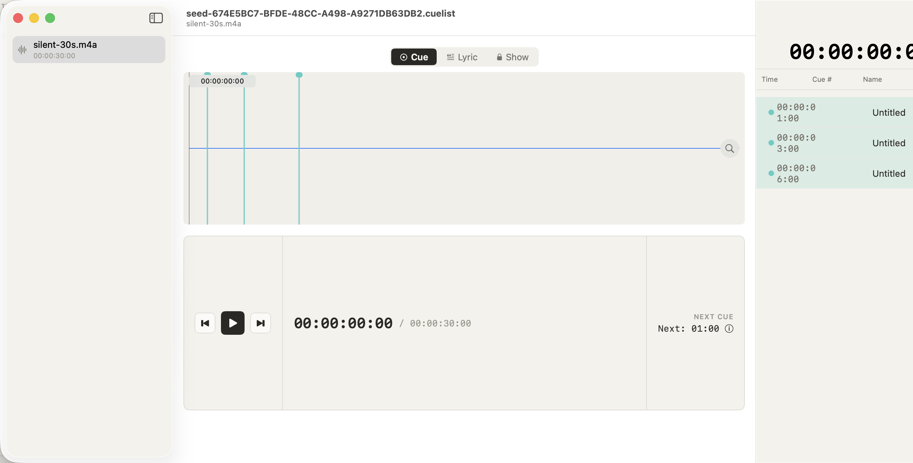
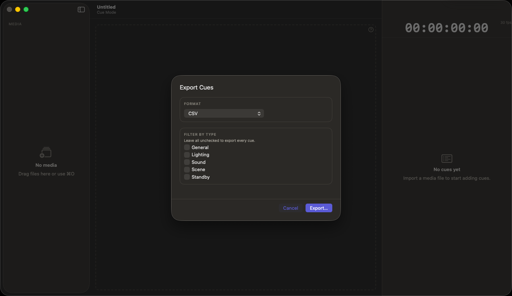
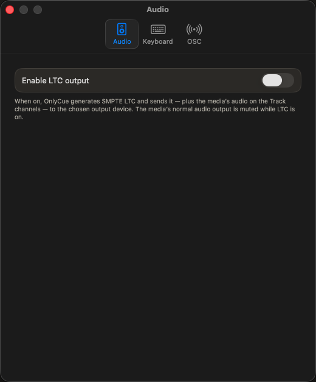
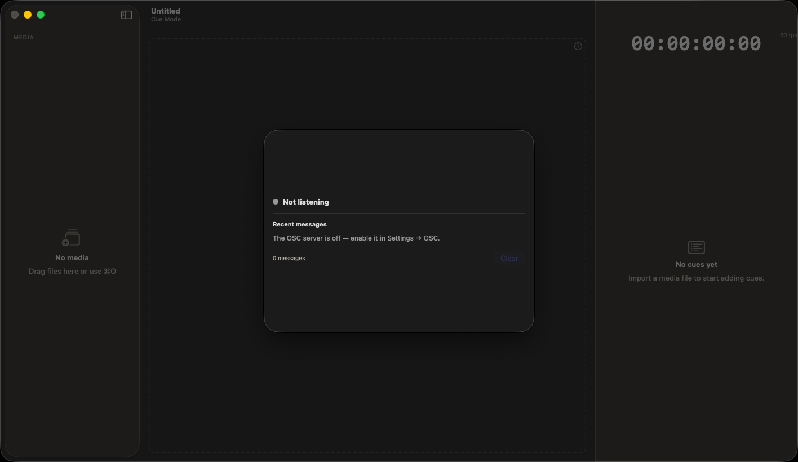

# OnlyCue

A native macOS application for lighting designers and show programmers, inspired by [CuePoints](https://cuepoints.com/). Import a media file (audio or video), preview it, and lay out a **cue list** — an ordered set of named, color-coded markers anchored to timestamps — to plan and communicate timing for live shows or TV.

## Table of Contents

- [OnlyCue](#onlycue)
  - [Table of Contents](#table-of-contents)
  - [Screenshots](#screenshots)
  - [Design](#design)
  - [Install](#install)
  - [Status](#status)
    - [Current release](#current-release)
    - [Shipped beyond MVP (on `dev`)](#shipped-beyond-mvp-on-dev)
    - [In progress / next](#in-progress--next)
  - [UI sections (canonical names)](#ui-sections-canonical-names)
    - [Document Window](#document-window)
    - [Auxiliary surfaces](#auxiliary-surfaces)
    - [Settings tabs](#settings-tabs)
  - [Build](#build)
    - [When to re-run xcodegen / clean the build folder](#when-to-re-run-xcodegen--clean-the-build-folder)
    - [Run tests and lint locally](#run-tests-and-lint-locally)
  - [Documents](#documents)
  - [Stack at a glance](#stack-at-a-glance)
  - [Reference](#reference)

## Screenshots

Document window (dark-only — ADR-029) with the "Set List — Act I" demo loaded: media library sidebar with compact clip durations, the Cue / Lyric / Show mode switcher, the achromatic waveform with numbered cue markers and lyric ribbons, the transport bar, and the cue list pane (one-line SMPTE times, clean rows) with the playhead clock pinned above it:


<!-- Regenerate: xcodebuild test -project OnlyCue.xcodeproj -scheme OnlyCue -destination 'platform=macOS' -only-testing:OnlyCueUITests/DocumentViewModeScreenshotTests/test_setListActI_darkMode_visualBaseline, then copy ~/Library/Containers/com.chienchuanw.OnlyCueUITests.xctrunner/Data/tmp/screenshots/main-setlist-cue-dark.png into static/document-window.png. The test forces dark via --ui-test-appearance=dark and seeds the populated Set List via --ui-test-seed=set-list-act-i. -->

Export Cues sheet (`⇧⌘E`) — format picker and per-cue-type filter:



OSC settings (Settings → OSC) — enable the receive-only OSC server and pick a listen port:



OSC Monitor (`Tools → OSC Monitor…`) — live message tail and copyable address list:



## Design

OnlyCue's interface is built against a Figma design system, kept as the source of truth for layout, spacing, and the achromatic main-window chrome (ADR-024):

- **[OnlyCue Design System on Figma](https://www.figma.com/design/NhH2957iKQ8b581x3gI3Wk/OnlyCue-Design-System)**

The Screens page covers the [Document Window](#document-window)'s three editor modes — Cue Mode, Lyric Mode, and Show Mode — plus Empty and populated Video Project frames. App↔Figma fidelity is tracked as a Phase-2 audit (decisions recorded as ADRs in [`docs/decisions.md`](docs/decisions.md), e.g. lyric-ribbon visibility and the lyrics inspector). The `*ScreenshotTests` capture dark-mode baselines of each mode for 1:1 comparison against these frames, seeded deterministically via `UITestSeedHandler` — including the populated `set-list-act-i` and `video-project` seeds.

## Install

Download the latest DMG from the [releases page](https://github.com/chienchuanw/only-cue/releases) and follow these steps:

1. Open `OnlyCue-x.y.z.dmg` and drag **OnlyCue** into your Applications folder.
2. Eject the DMG.
3. **First launch:** OnlyCue isn't signed with a paid Apple Developer ID, so macOS Gatekeeper blocks the first launch with *"Apple could not verify 'OnlyCue' is free of malware…"*. Clear it once — either way works, then future launches are silent:
   - **System Settings (macOS 13+):** double-click OnlyCue (it gets blocked — click **Done**), then open **System Settings → Privacy & Security**, scroll to the **Security** section, and click **Open Anyway** next to the OnlyCue notice; confirm and authenticate. On **macOS 15 (Sequoia)** this is required — the old Control-click → Open no longer clears this particular dialog.
   - **Terminal (any macOS version):** run `xattr -dr com.apple.quarantine /Applications/OnlyCue.app`, then open OnlyCue normally.

Why the extra step? OnlyCue is currently distributed without a paid Apple Developer ID signature. The `.app` is ad-hoc signed and unmodified; clearing the quarantine flag once is the standard macOS bypass. If you'd rather avoid it, [build from source](#build).

System requirements: macOS 14 (Sonoma) or later, Apple silicon or Intel.

## Status

### Current release

**[v0.22.0](https://github.com/chienchuanw/only-cue/releases/tag/v0.22.0) is the latest release** — **see the music, not the timecode, in every waveform**. Fixes a bug where the **Edit Media** preview still drew the LTC channel for a striped file (the main waveform already hid it), so now **no waveform shows the timecode buzz**. Adds an opt-in **View ▸ Split Channels** mode that draws **one waveform lane per music channel** — so you can read left/right separately in stereo music — while the detected LTC channel is kept out of the lanes and named in the badge (e.g. `R = LTC (muted)`). The toggle is **off by default**, so existing waveforms are unchanged; the playhead, cue markers, and click-to-seek span all lanes.

Earlier releases: [v0.21.0](https://github.com/chienchuanw/only-cue/releases/tag/v0.21.0) (**rearrange the workspace and save named layouts** — resizable/collapsible sidebar + inspector per editor mode, saved as named **workspace presets** via **View ▸ Workspace**, applied to the frontmost window, without changing the document format), [v0.20.0](https://github.com/chienchuanw/only-cue/releases/tag/v0.20.0) (**hear only the music from a file that has timecode striped on it** — the detected LTC channel is **auto-muted** with the music centered to both ears, the **waveform draws the music track only** with a start-timecode **badge**, and a per-clip **Music only / Original** toggle persists in the project), [v0.19.0](https://github.com/chienchuanw/only-cue/releases/tag/v0.19.0) (**map a MIDI controller to OnlyCue, and read timecode striped onto imported audio** — a **Settings ▸ MIDI** pane with **MIDI-learn** binding notes/CC to **GO**/**Stop** with a live monitor, plus a cached **per-channel** LTC scan that shows an imported file's own timecode independently of LTC output), [v0.18.1](https://github.com/chienchuanw/only-cue/releases/tag/v0.18.1) (PotPlayer bookmark export now loads on Windows — the `.pbf` is written as **UTF-16LE + BOM with CRLF**), [v0.18.0](https://github.com/chienchuanw/only-cue/releases/tag/v0.18.0) (first PotPlayer bookmark export — its `.pbf` encoding didn't load on Windows; fixed in v0.18.1), [v0.17.0](https://github.com/chienchuanw/only-cue/releases/tag/v0.17.0) (the grandMA2 push gets simpler: **console credentials are no longer entered** — grandMA2's fixed default `administrator` account is used automatically, so the Username / Password fields and the Keychain entry behind them are gone, leaving Settings asking only for the console IP (with **Scan**) and the telnet port; and each push flow now shows only what it uses — **Send to grandMA2…** dropped the unused Timecode-slot and Go/Goto controls, while **Export grandMA2 plugin…** gained its own settings sheet for the timecode object it does build), [v0.16.0](https://github.com/chienchuanw/only-cue/releases/tag/v0.16.0) (three grandMA2-push refinements: Settings can **scan the network for consoles**, **Send to grandMA2…** shows an **editable English-sanitized sequence name** remembered per clip, and the live push **carries each cue's info** into grandMA2's Info field), [v0.15.0](https://github.com/chienchuanw/only-cue/releases/tag/v0.15.0) (**push a clip's cues to grandMA2** two FTP-free ways — a live telnet **Send to grandMA2…** that builds the sequence as per-cue timecode triggers and works on onPC, and an **Export grandMA2 plugin…** that generates a `.lua` plugin building a sequence + a real timecode show on any console), [v0.14.2](https://github.com/chienchuanw/only-cue/releases/tag/v0.14.2) (fixes the **severe playhead judder — and eventual hang — at high zoom** during follow playback: the waveform, grid, ruler and markers are rendered once and only translated each frame, so playback stays smooth up to the 64× maximum zoom, with or without LTC), [v0.14.1](https://github.com/chienchuanw/only-cue/releases/tag/v0.14.1) (two playback/UI fixes: the zoomed playhead-follow scroll no longer **shimmers** and the playhead no longer **jumps forward on pause**; and selecting a cue or a clip no longer shows the macOS **blue selection highlight**), [v0.14.0](https://github.com/chienchuanw/only-cue/releases/tag/v0.14.0) (**smooth continuous playhead-follow scrolling**: during playback with the waveform zoomed in and Auto-Scroll on, the playhead is pinned at ~1/3 of the viewport and the waveform and the LTC strip flow continuously underneath it — no more jumpy, anchor-bucket scrolling — leaving ~2/3 of the view as look-ahead), [v0.13.0](https://github.com/chienchuanw/only-cue/releases/tag/v0.13.0) (four waveform/cue-list refinements: deeper horizontal zoom (max **16× → 64×**); the **LTC strip now follows the waveform's zoom + scroll** so the playheads stay aligned when zoomed; the cue at the playhead is **highlighted in the cue list in Cue mode** and the list auto-scrolls to it while playing; and a cleaner waveform (no hand cursor) with finer **cue-marker retiming**), [v0.12.1](https://github.com/chienchuanw/only-cue/releases/tag/v0.12.1) (fixes a v0.12.0 layout regression: the cue-list column headers **# · Name · Info** now line up with the row values), [v0.12.0](https://github.com/chienchuanw/only-cue/releases/tag/v0.12.0) (the cue list slimmed to grandMA2-style **# · Name · Info** columns — Time and Fade dropped, cues start unnamed with an inline-editable notes column — and the **LTC strip** lost its header so its ruler and playhead line up exactly with the waveform above it, with the per-clip LTC mute moved to the media right-click menu), [v0.11.0](https://github.com/chienchuanw/only-cue/releases/tag/v0.11.0) (in **Show mode**, GO / prev-cue / next-cue can be filtered to a single **cue type**, with the highlight and notes following the filter and other-type cues dimmed; and the **Timeline Breakdown**'s hidden-lane footer is now a menu that re-shows a single lane at a time), [v0.10.0](https://github.com/chienchuanw/only-cue/releases/tag/v0.10.0) (three LTC-output improvements — an independent **LTC output level** slider, a **moving playhead** on the LTC strip, and **the same role on multiple channels** — plus a fix so the Edit Media Start-timecode field fits the full `HH:MM:SS:FF`), [v0.9.0](https://github.com/chienchuanw/only-cue/releases/tag/v0.9.0) (Show mode GO — a GO button, the Return key, and the OSC address `/onlycue/cue/go` to walk the cue list one hit at a time while audio and LTC timecode keep running), [v0.8.0](https://github.com/chienchuanw/only-cue/releases/tag/v0.8.0) (Export Bundle — File ▸ Export Bundle… packages a project with all its audio into one self-contained folder that opens on any machine with no relink — and Show in Finder on the media right-click menu), [v0.7.4](https://github.com/chienchuanw/only-cue/releases/tag/v0.7.4) (renders the waveform from per-bucket RMS energy, so loud brickwall-limited masters show their real loudness dynamics instead of collapsing into a solid saturated block), [v0.7.3](https://github.com/chienchuanw/only-cue/releases/tag/v0.7.3) (keeps the waveform inside its box on loud tracks, removes the vertical waveform zoom and the redundant "Welcome to OnlyCue" File-menu item, and trims a stray test fixture that had been bundled into the app), [v0.7.2](https://github.com/chienchuanw/only-cue/releases/tag/v0.7.2) (the document window can now shrink to fit 1280-wide displays; lyric-inspector timestamps stay on one line; the waveform playhead compensates for audio-output latency), [v0.7.1](https://github.com/chienchuanw/only-cue/releases/tag/v0.7.1) (the launch flow now shows only the "Welcome to OnlyCue" start window, no longer popping the macOS Open dialog beside it), [v0.7.0](https://github.com/chienchuanw/only-cue/releases/tag/v0.7.0) (the **start window**: a "Welcome to OnlyCue" screen with recent projects plus New Project / New from Template… / Open Other…; and Show mode made fully read-only — cues can't be created by any means while running a show), [v0.6.6](https://github.com/chienchuanw/only-cue/releases/tag/v0.6.6) (a relinked clip's waveform renders immediately instead of sticking on the spinner), [v0.6.5](https://github.com/chienchuanw/only-cue/releases/tag/v0.6.5) (robust media re-linking — auto-finds media still in its original folder, and the "Relink media…" picker reliably opens for genuinely-missing files), [v0.6.4](https://github.com/chienchuanw/only-cue/releases/tag/v0.6.4) (centered the active clip's filename in the inspector; first relink repoint), [v0.6.3](https://github.com/chienchuanw/only-cue/releases/tag/v0.6.3) (save-on-close prompt instead of silently dropping edits, the relink groundwork, and inspector header polish), [v0.6.2](https://github.com/chienchuanw/only-cue/releases/tag/v0.6.2) (editing a cue's name/number/fade no longer loses the arrow keys to the transport/step shortcuts, and the cue inspector shows the active clip's filename), [v0.6.1](https://github.com/chienchuanw/only-cue/releases/tag/v0.6.1) (cleaner cue exports — the internal UUID column dropped from CSV/TSV while grandMA keeps its `GUID`, and the suggested filename is `abc.csv` rather than `abc.mp3.csv`), [v0.6.0](https://github.com/chienchuanw/only-cue/releases/tag/v0.6.0) (a "Check for Updates" menu item and cue numbers added to the Export Cues output), [v0.5.0](https://github.com/chienchuanw/only-cue/releases/tag/v0.5.0) (a full Figma-fidelity pass: a new app icon, a redesigned First Launch sheet, rebuilt Audio and Timecode settings, the cue-mode inspector overhaul with a 5px cue-type stripe and wider inspector, and the lyric purple color system), [v0.4.1](https://github.com/chienchuanw/only-cue/releases/tag/v0.4.1) (dark-only main window — ADR-029 — with one-line SMPTE cue rows, compact sidebar durations, and an achromatic waveform), [v0.4.0](https://github.com/chienchuanw/only-cue/releases/tag/v0.4.0) (the "Quiet Pro" design-token redesign, the Cue / Lyric / Show editor-mode system with a full lyrics workflow, encrypted `.cuelist` documents, portable `.occues` cue lists, loop / auto-next playback — schema settled at v15), [v0.3.0](https://github.com/chienchuanw/only-cue/releases/tag/v0.3.0) (LTC routing, per-media timecode, cue-anchored tempo, SMPTE rendering), [v0.2.0](https://github.com/chienchuanw/only-cue/releases/tag/v0.2.0), and the MVP [v0.1.0](https://github.com/chienchuanw/only-cue/releases/tag/v0.1.0) (13 MVP issues via PRs [#14–#26](https://github.com/chienchuanw/only-cue/pulls?q=is%3Apr+is%3Amerged)).

### Shipped beyond MVP (on `dev`)

| Area | What's in |
| --- | --- |
| **Post-MVP enhancements** | Multi-media items per project (schema v2 with auto-migration, sidebar with drag-reorder, multi-file picker, per-item cues, background waveform prewarm); waveform strip beneath video imports; draggable playhead with HH:MM:SS scrub label; horizontal waveform zoom (1×–16× via trackpad pinch and `⌘=`/`⌘-`/`⌘0`) with auto-follow during playback. |
| **Epic [#32](https://github.com/chienchuanw/only-cue/issues/32) — cue model rework** | **Complete.** First-class `CuePointType`, user-facing `Cue.cueNumber` with mid-point insertion, required `Cue.fadeTime` (split-fade syntax), cue inspector pane, "Manage Types…" sheet, number-key cue creation. Schema settled at v6 with deterministic migrations from v1+. |
| **Epic [#33](https://github.com/chienchuanw/only-cue/issues/33) — LTC generation + audio routing** | **Complete.** Generates SMPTE Linear Timecode synced to playback (24 / 25 / 30 ND / 30 DF), routable to a chosen Core Audio output. `Settings → Audio` has a master **"Enable LTC output"** toggle (off by default); when on, pick the output device and assign each channel a role — LTC, Track L, Track R, or Silent. While LTC runs with Track channels assigned and media loaded, the media's audio is replayed through the LTC engine onto those channels and `AVPlayer` is muted, so the routed device carries only what the engine produces — the LTC channel is never summed with program audio. Imported files already striped with LTC drive the transport's SMPTE readout; we generate and display timecode, we don't chase it. The live audio/device path is verified by running the app against an interface (the pure parts are unit-tested). ADR-019. |
| **Epic [#34](https://github.com/chienchuanw/only-cue/issues/34) — console export** | **Complete.** File → Export Cues… (`⇧⌘E`) → sheet with a format picker (CSV / TSV / grandMA3 / grandMA2 — the last two best-effort, no authoritative format docs in-repo) and per-`CuePointType` filter. Two orthogonal pure functions (`CueExportFilter` + `CueCSVExporter`) plus an AppKit save action; golden-file tests pin all four targets. ADR-013/014. The CSV/TSV output carries the user-facing cue `number` and omits the internal UUID (grandMA keeps its `GUID` for re-import identity); the save panel suggests `<media>.csv`, not `<media>.<ext>.csv`. |
| **Epic [#35](https://github.com/chienchuanw/only-cue/issues/35) — OSC remote control** | **Complete.** Receive-only OSC server (UDP, `Network.framework`, hand-rolled OSC 1.0 parser — no dependency); Settings → OSC enable toggle + listen port; transport (`/onlycue/play\|pause\|stop\|skip\|locate`) and cue (`/cue/add\|next\|prev`) commands; `Tools → OSC Monitor…` sheet with a live message tail + copyable address list; Bitfocus Companion / StreamDeck / grandMA3 macro reference in [`docs/osc-companion-ma3.md`](docs/osc-companion-ma3.md). Per-document server (one document responds — ADR-016). |
| **Epic [#36](https://github.com/chienchuanw/only-cue/issues/36) — timeline UX polish** | **In progress.** ↑/↓ keyboard step to prev/next cue; ⌘⌥=/⌘⌥-/⌘⌥0 vertical waveform zoom; single hover-revealed magnifier on the right edge for two-axis click-and-drag zoom (Shift-locks to dominant axis, double-click resets both); `S` snaps the selected cue to the playhead; ⌥←/⌥→ nudge it by a configurable step; `⌘D` duplicates the cue at the playhead. Waveform gain control and the Cmd/Shift multi-select model still pending. |
| **Epic [#37](https://github.com/chienchuanw/only-cue/issues/37) — timeline breakdown view** | **Complete.** `View → Show Timeline Breakdown` (`⇧⌘B`) swaps the preview's timeline for one lane per visible `CuePointType` — each with that Type's markers, a hide button, and a playhead line spanning all lanes; "+N hidden lanes" restores hidden ones. Lane visibility (`CuePointType.isVisible`) persists in `.cuelist` with no schema bump (ADR-017). Layout covered by `TimelineBreakdownLayout(Fidelity)Tests` + `CueCommandsVisibilityTests` (incl. a v3-migrated `.cuelist` fixture); a media-loaded UI screenshot fixture remains the one deferred item. |
| **Epic [#38](https://github.com/chienchuanw/only-cue/issues/38) — notes overlay** | **In progress.** HUD-style overlay rendering the active cue's notes on top of the preview; Tools-menu appearance sheet customising position, font scale (0.75×–3×), text color, optional solid background, optional cue-number prefix; restore-defaults button. |
| **Epic [#40](https://github.com/chienchuanw/only-cue/issues/40) — custom keyboard shortcuts** | **Complete.** Settings → Keyboard tab lets you rebind any command — menu items *and* the document-window keys (`m` add cue, `0`–`9` cue-type hotkeys, Space, ←→ jump, ↑↓ step cues) — click a row, press a new chord, Esc cancels; per-row reset-to-default, conflict ⚠︎ (advisory — duplicates allowed), Reset All. The keymap is a sparse, forward-tolerant JSON object under `keymap.v1` (`KeymapStore`); `AppCommands` / `DocumentView` / the on-screen cheat-sheet all read it; defaults equal the prior hardcoded shortcuts (ADR-018). While an inline cue field (name/number/fade) is being edited, the bare arrow-key transport/step shortcuts yield to the text field so the caret moves normally (`InlineEditGate`, #573). |
| **Epic [#39](https://github.com/chienchuanw/only-cue/issues/39) — templates** | **Complete.** Save the project's `CuePointType` set as a `.cuelist-template` under `~/Documents/OnlyCue/Templates/`; File → Load Template… merges a template into the open project (append + fresh UUIDs so existing cues' `typeID` references never break — ADR-015); File → New from Template… starts a new document pre-loaded with a template's Type set. |
| **Epic [#231](https://github.com/chienchuanw/only-cue/issues/231) — per-media LTC** | **Complete.** Per-`MediaItem` start timecode and mute flag (schema v10 with deterministic migration from v9); `LTCStrip` rendered in the main pane when LTC routing is enabled, with a per-clip mute control and a timecode ruler; per-media TC editor in the sidebar plus a project-wide Timecode Settings sheet. PRs [#238–#243](https://github.com/chienchuanw/only-cue/pulls?q=is%3Apr+is%3Amerged+238..243). |
| **Tempo (cue-anchored)** | **Complete.** Tempo is anchored to cues, not stored as a separate map: each `Cue` carries an optional `bpm` and `beatsPerBar`, and `DerivedTempoGrid` derives beat / bar lines from the cue sequence at render time. Per-cue tempo inspector with a "Detect" button (`SpectralFluxTempoAnalyzer` over the audio span up to the next tempo-bearing cue); optional BPM column in the cue list; the standalone TempoMap, Tempo Map sheet, and auto-cue-on-grid menu items were removed in favor of this simpler model. Schema settled at v11 with migrations from v10. Supersedes the earlier `TempoMap` work from epic #199. |
| **Main-view polish** | **Complete.** Rename to "Only Cue" in the main view, decluttered layout, hi-res waveform (12k peaks), smooth playhead interpolation, click-to-seek anywhere on the waveform, and a fixed playhead time-label clipping bug. PRs #221–#228. |
| **CueList redesign** | **Complete.** Resizable Time / Number columns, moved Manage Types to the Tools menu, draggable cue markers / group drags on the timeline, and a `UITestSeedHandler` for deterministic UI test fixtures. PRs #260–#268. |
| **SMPTE timecode rendering** ([#289](https://github.com/chienchuanw/only-cue/issues/289)) | **Complete.** Every displayed time — transport readout, next-cue countdown, cue row, media row, playhead label, timeline ticks — renders as HH:MM:SS:FF at the project framerate via a shared `TimeFormat` formatter and a `projectFramerate` SwiftUI environment value seeded at `DocumentView`. The old `HH:MM:SS.mmm` formatters were removed. |
| **Cue Inspector redesign** ([#291](https://github.com/chienchuanw/only-cue/issues/291), [#293](https://github.com/chienchuanw/only-cue/issues/293)) | **Complete.** The standalone `CueInspectorView` pane was removed. Cue rows now expose Number / Name / Fade inline, and Type / Notes / Tempo move to right-click → modal sheets (`CueTypeSheet`, `CueNotesSheet`, `CueTempoSheet`). A playhead clock (`PlayheadClockHeader`) is pinned above the cue list and renders the current transport as SMPTE timecode. |
| **Playback speed** ([#283](https://github.com/chienchuanw/only-cue/issues/283)) | **Complete.** 0.1×–3.0× pitch-preserving time-stretch via `AVAudioMixInputParameters`; `[` / `]` / `\` shortcuts plus a Playback menu; a rate badge on the transport bar; LTC interlock blocks non-1.0× rates while LTC output is enabled. PR #284. |
| **Beat-tempo countdown** ([#281](https://github.com/chienchuanw/only-cue/issues/281)) | **Complete.** The transport's `Next:` countdown switches to beat-tempo units when the upcoming cue carries a tempo, falling back to SMPTE otherwise. PR #282. |
| **Per-media edit panel** ([#279](https://github.com/chienchuanw/only-cue/issues/279)) | **In progress.** Per-`MediaItem` `alternateName` (display override) and `resolvedName` (effective name resolver) with schema migration v11 → v12. |
| **Portable cue lists** ([#366](https://github.com/chienchuanw/only-cue/issues/366)) | **Complete.** `Cue → Export Cue List…` / `Import Cue List…` move one song's cue list between projects as a portable `.occues` file — the `.cuelist` AES-256-GCM envelope reused with a distinct `OCCU` magic and its own `formatVersion`. Import reconciles cue types additively (every imported `CuePointType` becomes a new project type, `hotkey` cleared, `(imported)` suffix on a name clash) and gives imported cues fresh ids with remapped `typeID`s, preserving `cueNumber`; a source-media mismatch prompts and a non-empty target offers Replace / Add / Cancel — all in one undo group. `ProjectModel` and `schemaVersion` are untouched (ADR-025). PR #367. |
| **Encrypted documents** ([ADR-021](docs/decisions.md)) | **Complete.** `.cuelist` files are sealed in an AES-256-GCM envelope (`CuelistCrypto`) on save and read transparently; legacy plaintext documents still open, and a tampered envelope maps to a clean corrupt-file error. The Finder kind column reads "OnlyCue Document". |
| **Editor modes + Lyrics** ([ADR-022](docs/decisions.md), [ADR-023](docs/decisions.md)) | **Complete.** A Cue / Lyric / Show mode switcher drives the editor: Cue mode edits markers, Show mode is a read-only performance state (snap / nudge / duplicate gated off), and Lyric mode adds a tall lyrics lane with drag-to-retime plus click-to-drop and tap-along placement. Lyric lines (`LyricLine`, optional time) persist per `MediaItem` (schema v13–v14) and route through `CueCommands+Lyrics`; lyric ribbons stay visible across modes and the Lyrics inspector follows the Figma section layout ([ADR-026](docs/decisions.md), [ADR-027](docs/decisions.md)). The standalone modal Lyrics Editor was retired. |
| **Quiet Pro redesign** ([ADR-024](docs/decisions.md)) | **Complete.** An achromatic, design-token-driven main window built against the [Figma design system](#design): `DS.Color` / `DS.Text` / `DS.Space` / `DS.Radius` tokens, `dsCard` / `dsSectionHeader` / `dsHairline` modifiers, a zoned transport bar, a single-import empty state, and an indigo accent reserved for primary actions. A `TokenConformanceTests` gate forbids raw colors, system-font sizes, and magic padding in the main-window files. |
| **Figma fidelity pass** (#413, #416, #417, #463, #465, #467, [#469](docs/decisions.md)) | **Complete.** A close audit against the Figma frames closed the remaining cosmetic gaps: section headers and count badges on the cue list / lyrics / OSC panes, the restyled LTC strip and a non-interactive waveform time-ruler, and a boxed SMPTE Sync Offset field. Displayed times follow the project framerate (`HH:MM:SS:FF`), the offset stays ≥ 0 ([ADR-028](docs/decisions.md)), and populated `set-list-act-i` / `video-project` UI-test seeds back the dark-mode screenshot baselines. |
| **Waveform & playback fixes** (#534–#540) | **Complete.** Per-file waveform normalization so loud clips show dynamics instead of a solid block; playhead re-anchored on resume (no jump-then-snap-back); wider cue-marker grab zone + high-priority drag so markers retime instead of seeking; **Renumber Selected** cues (resequence in time order); the waveform scrolls to reveal the selected cue; and peak columns aligned to the playhead/cue time mapping. An **Auto-Scroll Waveform** View-menu toggle (#532) was added earlier in the same arc. |
| **Playhead AV-sync compensation** ([#611](https://github.com/chienchuanw/only-cue/issues/611)) | **Complete.** The rendered playhead subtracts the output device's audio-pipeline latency (new `AudioOutputLatency` CoreAudio seam: device + safety-offset + IO-buffer + stream latency over the nominal sample rate, clamped to 0.5s, refreshed on each play) so it tracks what is *audible now* rather than what `AVPlayer` has queued — the compensation scales automatically for high-latency (Bluetooth) outputs while paused/seek paths stay exact. Backed by deterministic click-track instrumentation (`WaveformClickAlignmentTests`: a 10.000s click through the real generate→bucket→columnX pipeline lands within one column of the playhead mapping). PR #612. |
| **CI + fidelity upkeep** (#548–#556) | **Complete.** CI slimmed to lint + build + unit as the required gate; the flaky screenshot/baseline UI tests moved to an on-demand `workflow_dispatch` job and dead/always-skipped UI tests pruned. The Figma-audit backlog (#495) was decomposed and worked region-by-region — switcher-bar, LTC strip, and transport-bar spacing/sizing pinned to spec via `Metrics` value-pins, plus assorted low-severity nits; the lyric `Set from Playhead` button was kept and the Figma component reconciled to match (ADR-027). |
| **Playback modes** (#369) | **Complete.** A `PlaybackMode` (off / loop / auto-next) with a Playback-menu group, a transport badge for loop and auto-next, end-of-media dispatch per mode with the LTC interlock respected, and `advanceToNextMediaAndPlay` capturing the next index at fire time. Schema v14 → v15 with migration. |
| **Stand-alone leaves** | Cue inspector commits drafts on outside-click (window-scoped `NSEvent` monitor); File → Import Media… menu entry with ⌘O (canonical menu owner); ⇧⌘P "pause at each cue" mode; ⇧⌘N notes-overlay toggle; clickable empty-preview placeholder; manual cue numbering (`CueNumberValidator`, schema v8→v9); menu bar reorganized so cue-editing commands (snap/duplicate/nudge) live in a dedicated **Cue** menu and "pause at each cue" moved under **Playback** (PR #299); View menu horizontal-zoom items relabeled (`Zoom In/Out Horizontally`, `Actual Horizontal Size`) to read parallel with the vertical group (PR #301); menu toggles (Notes Overlay / Timeline Breakdown / Tempo Grid, and Playback's pause-at-each-cue) now use a Show/Hide-style state-flipping verb instead of native checkable items, removing the checkmark-column indent (PR #303); fixed a p1 `NSSplitView` constraint-loop crash when dragging the main / cue-list inspector divider — the fixed Time/Cue#/Fade columns are now compressible so the cue-list content's minimum width stays within the inspector column minimum ([#297](https://github.com/chienchuanw/only-cue/issues/297), PR #306). |
| **Release pipeline** | Self-serve: `bash scripts/build-release.sh && bash scripts/make-dmg.sh` produces a drag-installable DMG. Default `RELEASE_MODE=unsigned` is free-tier-friendly (ad-hoc signed). `RELEASE_MODE=signed` opt-in for Developer ID + notarization once on a paid Apple Developer Program. Procedure in [`docs/release.md`](docs/release.md). |

### In progress / next

- **Phase 2 — Pro handoff** — nine epics filed; #32, #33, #34, #35, #37, #39 and #40 complete; #36 and #38 in flight.
- **Live status** — [`docs/task_plan.md`](docs/task_plan.md) is the source of truth for what's open / in flight.
- **Append-only history** — [`docs/progress.md`](docs/progress.md) carries the per-PR narrative with rationale for every load-bearing decision.
- **Issue board** — [github.com/chienchuanw/only-cue/issues](https://github.com/chienchuanw/only-cue/issues).

## UI sections (canonical names)

These are the stable names to use in specs, issues, PRs, design docs, and verification scripts when referring to a part of the UI. The Swift type implementing each section is in parentheses; the accessibility identifier (where one exists) is in `code` so UI tests can target it directly.

### Document Window

The top-level per-`.cuelist` window. A three-pane `NavigationSplitView` with a stacked center column.

- **Media Library Sidebar** (`ItemListPane`) — left column. The list of `MediaItem`s in the project, with drag-reorder, multi-file picker entry, the per-item TC editor row (`MediaTimecodeRow`), and drop targets for new media. Row view: `ItemRowView`. Right-click → "Edit Media…" opens the **Edit Media sheet** (`MediaEditSheet`): a hero preview strip (`MediaPreviewStrip`, ID `mediaEditPreviewStrip` — audio waveform or video poster frame via `VideoPosterGenerator`) above a read-only file-identity row (`mediaEditIdentity`), then the alternate-name, start-timecode, and per-clip LTC-mute fields.
- **Main Pane** (`DocumentView.mainPane`) — center column. Stacks the following from top to bottom:
  - **Preview Pane** (`PreviewPane`, ID `previewPane`) — video surface or audio waveform display.
    - **Video Surface** (`AVPlayerLayerView`, ID `videoPreview`) — present only when the active item is a video.
    - **Timeline Strip** — either the **Waveform View** (`WaveformContainer` / `WaveformView`, IDs `videoWaveform` / `audioWaveform`) with cue markers and the draggable **Playhead Overlay** (`PlayheadOverlay`), or the **Timeline Breakdown** (`TimelineBreakdownView`, ID `timelineBreakdownArea`) when `View → Show Timeline Breakdown` is on. The waveform is overlaid by **Cue Markers** (`CueMarkersOverlay`), the **Tempo Grid Overlay** (`TempoGridOverlay`) when enabled, and the **Waveform Zoom Magnifier** (`WaveformZoomMagnifier`) on hover. Seek surface and visual layer are split (`WaveformSeekSurface` + `WaveformPlayheadVisual`) so cue markers remain reachable to clicks.
    - **Notes Overlay** (`NotesOverlayView`) — HUD-style cue-notes overlay rendered on top of the preview when `⇧⌘N` is on.
    - **Empty Preview Placeholder** (`DocumentEmptyState`, ID `emptyPreview`) — shown when no media is loaded; clickable.
  - **LTC Strip** (`LTCStrip`) — per-clip timecode ruler with a mute button. Visible only when LTC routing is enabled and a media item is loaded (per-media LTC, epic #231).
  - **Transport Bar** (`TransportBar`) — single-line SMPTE readout (`current / total` rendered as HH:MM:SS:FF at the project framerate, ID `currentTimeReadout`), an optional `SMPTE …` readout (ID `smpteTimecode`) shown only when LTC output is enabled in Settings, and the `Next:` countdown to the upcoming cue (also SMPTE-shaped, with an optional beat-tempo countdown when the next cue carries a tempo). No visible Play/Pause or Add Cue buttons — both are wired through hidden commands; Space toggles playback and the `.addCue` shortcut adds a cue at the playhead.
- **Cue List Pane** (`CueListPane`, ID `cueListPane`) — right pane. Stacks the following:
  - **Playhead Clock** (`PlayheadClockHeader`) — pinned at the top of the pane, renders the current transport time as SMPTE timecode (HH:MM:SS:FF) at the project framerate.
  - **Cue List** — filterable list of cues for the active item with a leading color stripe and columns for Time, Number, Name, and Fade; rows are `CueRowView`. Includes the optional **BPM Column** (cue-anchored tempo). When no cues exist, shows the **Cue List Empty State**.
  - **Cue Row Context Menu** — right-click on a row to edit Type, Notes, or Tempo. Each launches a modal sheet (`CueTypeSheet`, `CueNotesSheet`, `CueTempoSheet`) rather than a persistent inspector pane. Inline editing on the row itself covers Number, Name, and Fade. The standalone `CueInspectorView` was removed in favor of this row-and-modal model.

### Auxiliary surfaces

Sheets, panels, and overlays that float over (or replace) the Document Window:

- **First Launch Sheet** (`FirstLaunchSheet`) — one-time welcome.
- **Export Cues Sheet** (`ExportSheet`, via `ExportSheetPresenter`) — `File → Export Cues…` (`⇧⌘E`).
- **Timecode Settings Sheet** (`TimecodeSettingsSheet`) — project-wide framerate and start TC.
- **Type Management Sheet** (`TypeManagementSheet`) — `CuePointType` editor.
- **Notes Overlay Appearance Sheet** (`NotesOverlayPreferencesSheet`) — overlay position / font / color.
- **OSC Monitor Sheet** (`OSCMonitorView`) — `Tools → OSC Monitor…`.
- **Document Shortcut Hints** (`DocumentShortcutHints`) — on-screen cheat-sheet.

### Settings tabs

The app's Settings window (`⌘,`) hosts these tabs as siblings:

- **Audio** (`AudioSettingsView`) — master LTC enable toggle and per-channel role routing.
- **OSC** (`OSCSettingsView`) — receive-only OSC server enable + listen port.
- **Keyboard** (`KeyboardSettingsView`) — rebind any command, per-row reset, Reset All.

When adding a new UI surface, give it a canonical name here in the same PR — specs and verification scripts reference these names rather than file paths.

## Build

```bash
brew install xcodegen swiftlint   # one-time
xcodegen generate                  # produces OnlyCue.xcodeproj from project.yml
open OnlyCue.xcodeproj
```

`OnlyCue.xcodeproj/` is generated and gitignored — `project.yml` is the source of truth.

### When to re-run xcodegen / clean the build folder

- **Re-run `xcodegen generate`** whenever `project.yml`, `Info.plist`, or the source folder structure changes (new top-level folder under `OnlyCue/`, new target, new pre-build script). Pulling a branch that touched any of those counts.
- **`⌘⇧K` (Clean Build Folder)** in Xcode after switching branches that changed Swift concurrency annotations or other compile-time invariants — Xcode's incremental build sometimes hangs on stale bitcode and surfaces it as a confusing build error (e.g., a Swift 6 `@MainActor` error on code that has already been fixed).
- **`⌘⇧⌥K` (Delete Derived Data)** if `⌘⇧K` doesn't clear the issue. Slower (full rebuild after) but resolves persistent stale-cache errors.

### Run tests and lint locally

```bash
xcodebuild test -project OnlyCue.xcodeproj -scheme OnlyCue -destination 'platform=macOS'
swiftlint --strict
```

## Documents

Read in this order:

1. [`docs/vision.md`](docs/vision.md) — what we're building and for whom
2. [`docs/mvp-scope.md`](docs/mvp-scope.md) — what's in and out for v1
3. [`docs/architecture.md`](docs/architecture.md) — modules, layout, key APIs
4. [`docs/data-model.md`](docs/data-model.md) — `ProjectModel`, `Cue`, file format
5. [`docs/build-sequence.md`](docs/build-sequence.md) — phased build order
6. [`docs/verification.md`](docs/verification.md) — how to know it works
7. [`docs/roadmap.md`](docs/roadmap.md) — phase 2+ and our differentiator
8. [`docs/decisions.md`](docs/decisions.md) — ADR log of locked choices
9. [`docs/task_plan.md`](docs/task_plan.md) — live phase tracker
10. [`docs/progress.md`](docs/progress.md) — append-only per-PR narrative

## Stack at a glance

| | |
| --- | --- |
| Language | Swift 5.10+ |
| UI | SwiftUI (`@Observable`, `DocumentGroup`) |
| Media | AVFoundation (`AVPlayer`, `AVAssetReader`) |
| Min OS | macOS 14 (Sonoma) |
| Project file | `.cuelist` (AES-256-GCM encrypted container; JSON payload, schema v15) |
| Distribution | Ad-hoc signed DMG (Developer ID + notarization opt-in) |

## Reference

- CuePoints (the inspiration): <https://cuepoints.com/>
