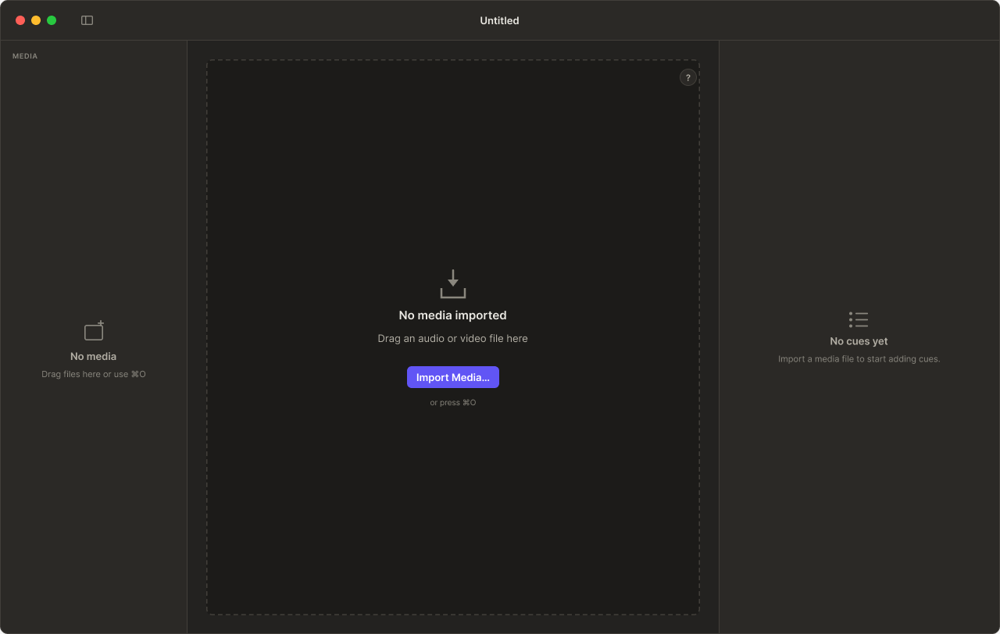
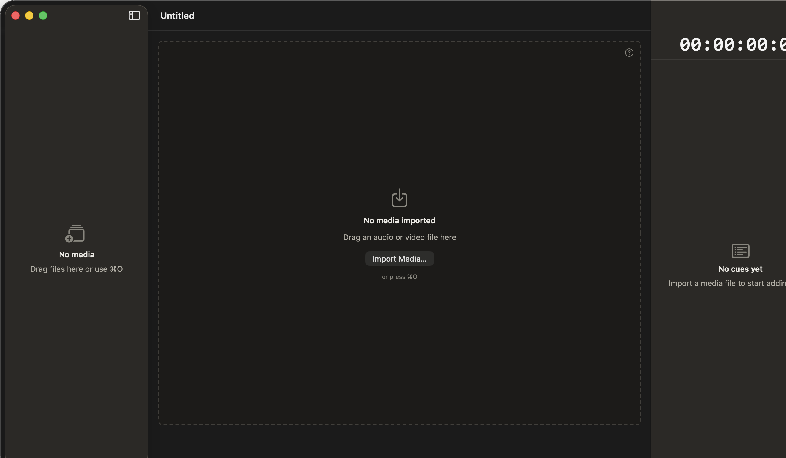
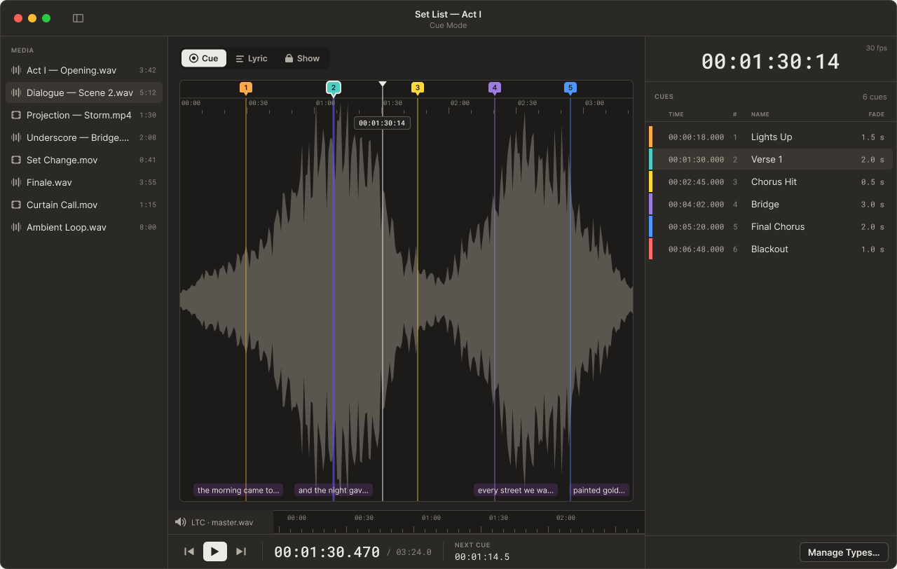
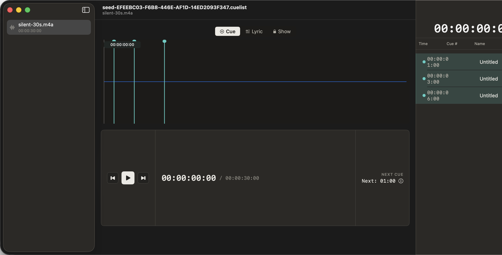
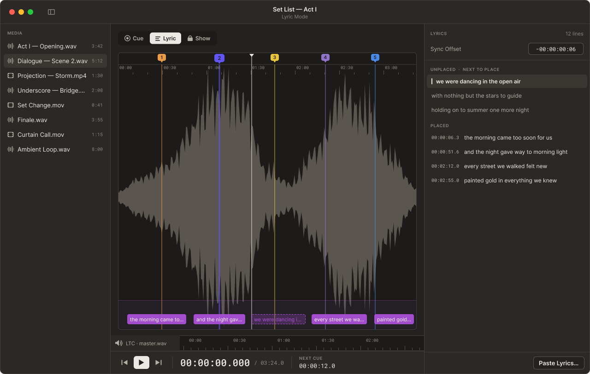
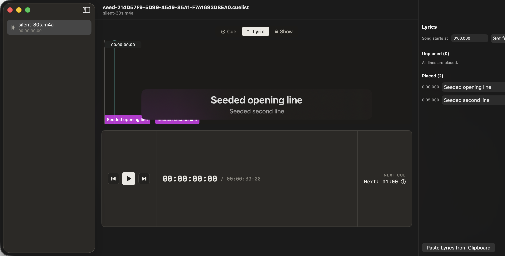
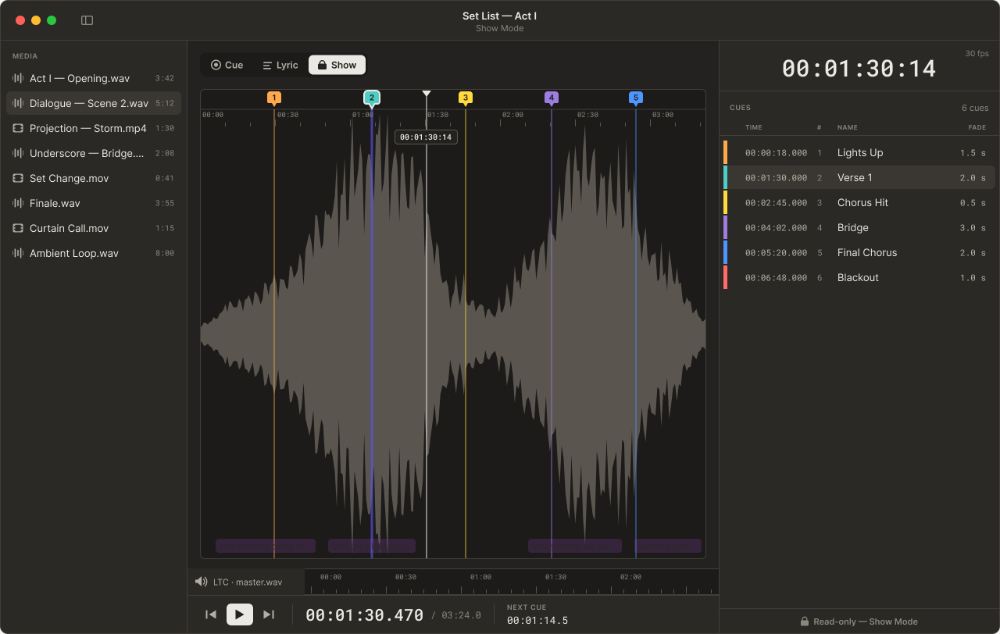
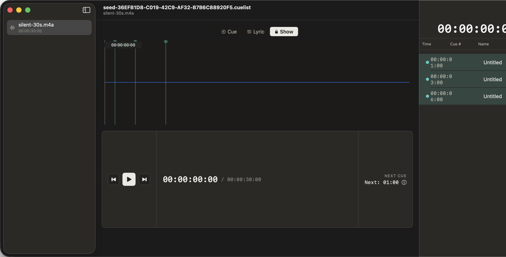

# Figma ↔ App Audit · Phase 2 (DocumentView mode variants)

**Reference:** [OnlyCue Design System · Screens](https://www.figma.com/design/NhH2957iKQ8b581x3gI3Wk/OnlyCue-Design-System?node-id=13-4)
**App version:** branch `issues/376` off `dev` (2026-05-24)
**Capture method:** `OnlyCueUITests/DocumentViewModeScreenshotTests` with `--ui-test-appearance=dark`, one test per `xcodebuild` invocation.
**Reads alongside:** [Phase 1 audit](./figma-app-audit.md) — the severity vocabulary and proposed-issue-grouping format are reused here without re-explanation.

## Scope of this phase

Four `DocumentView` mode captures are paired with their Figma references in this document:

- 1. Empty (Figma `318:1334`)
- 1. Cue Mode (Figma `318:1228`)
- 1. Lyric Mode (Figma `318:1369`)
- 1. Show Mode (Figma `318:1504`)

Two surfaces from the original Phase 2 plan are **deferred** and noted at the bottom:

- Populated (Figma `42:212`) — same seed as Cue Mode, structurally identical in current implementation; needs a richer seed to be visually distinct.
- Video Project (Figma `318:1614`) — requires a new `video-project` seed in `UITestSeedHandler` (not yet implemented).

## Scope limitation that affects every section below

The Figma references for the populated modes (Cue, Lyric, Show) depict the **design vision** with a fully-loaded show:

- Document title `Set List — Act I` + subtitle `Cue Mode`
- 8 named media tracks in the sidebar (Act I — Opening, Dialogue, Projection — Storm, etc.)
- 6 named cues (Lights Up, Verse 1, Chorus Hit, Bridge, Final Chorus, Blackout) with fade-time decorations
- Waveform with 5 distinctly-colored cue markers and per-marker numeric badges
- LTC strip pinned to the bottom of the editor
- 4 lyric ribbons placed under the waveform
- Right-side cue list with NAME and FADE columns populated
- 30-fps timecode badge in the top-right

The available app seed (`three-cues-1-3-6` on `silent-30s.m4a`) only seeds **1 media track with 3 anonymous untitled cues, 0 lyrics, no LTC, no fade times, no name column data**. So many of the deltas below are not "the app is wrong" — they are "the app cannot match Figma at the current seed fidelity." Each row of the delta tables tags whether it is a real bug (`structural` / `token` / `pixel-polish`) or a seed-fidelity issue (`seed`).

To avoid filing 30+ no-op issues for surface gaps that are really seed gaps, this phase's "Proposed follow-up issues" section is much shorter than Phase 1's. The bigger ask — building richer seeds so future audits are 1:1 — is captured as a single follow-up issue.

---

## 6. Main Window · Empty

**Figma:** [`318:1334`](https://www.figma.com/design/NhH2957iKQ8b581x3gI3Wk/OnlyCue-Design-System?node-id=318-1334) · 1280×812
**App:** `DocumentView.swift` + `DocumentEmptyState.swift` · captured via `DocumentViewModeScreenshotTests.test_empty_darkMode_visualBaseline`

| Figma | App |
|---|---|
|  |  |

### Deltas

| # | Severity | Area | Figma | App | Issue? |
|---|---|---|---|---|---|
| 6.1 | structural | Sidebar header | `MEDIA` caption (uppercase, `color/text-tertiary`) anchored top-left of the sidebar | App sidebar has **no header caption** above the "No media" affordance | yes |
| 6.2 | token | Import Media button | Indigo (`cue/indigo`) primary | App button is **also indigo** in this capture — looks like the cascade from Phase 1 II-C may already cover it; verify it's bound to the token, not hardcoded | partial — verify token binding |
| 6.3 | pixel-polish | Window chrome | Single close button visible (Figma omits zoom/minimize) | App shows all three traffic lights | no — keep app's behaviour, mark Figma as the surface to update |
| 6.4 | pixel-polish | Right-pane "No cues yet" placement | Vertically and horizontally centered in its column | Vertically and horizontally centered — visually matches | no |
| 6.5 | pixel-polish | Dashed import-zone border | 1 px dashed `color/border` stroke at ≈8-12 px dash pattern, padding inside ≈80 px | App matches the dashed pattern closely | no |
| 6.6 | state | Right pane content | Identical "No cues yet" + "Import a media file to start adding cues." | Matches | no |

**Verdict:** Empty mode is the closest pair in Phase 2. The only real bug is 6.1 (missing `MEDIA` caption).

### Proposed issue groupings

- **(VI-A)** Add `MEDIA` caption row above the empty-state sidebar in `DocumentEmptyState`. Covers 6.1.

---

## 7. Main Window · Cue Mode

**Figma:** [`318:1228`](https://www.figma.com/design/NhH2957iKQ8b581x3gI3Wk/OnlyCue-Design-System?node-id=318-1228) · 1280×812
**App:** `DocumentView.swift` (default editor mode, seed `three-cues-1-3-6`) · captured via `DocumentViewModeScreenshotTests.test_cueMode_darkMode_visualBaseline`

| Figma | App |
|---|---|
|  |  |

### Deltas

| # | Severity | Area | Figma | App | Issue? |
|---|---|---|---|---|---|
| 7.1 | seed | Sidebar media count | 8 tracks with durations (`3:42`, `5:12`, `1:30`, …) under a `MEDIA` caption | 1 track (`silent-30s.m4a`, `00:00:30:00`) — limited by the available seed | yes — file a seed-fidelity issue |
| 7.2 | seed | Document title | `Set List — Act I` with subtitle `Cue Mode` | `seed-<UUID>.cuelist` with subtitle `silent-30s.m4a` (seed-generated, opaque) | seed |
| 7.3 | structural | Mode segment placement | Cue / Lyric / Show segmented control centered horizontally above the waveform | Matches structurally; placement looks correct | no |
| 7.4 | token | Selected segment pill | Cue pill uses subtle elevated `color/panel` fill, **brand cue dot indigo** to the left of the label | App's Cue pill uses similar elevated fill but the leading dot is **teal/cyan** (not indigo); the dot is a small filled circle | yes — token mismatch on the cue indicator dot |
| 7.5 | seed | Cue list (right pane) | 6 named cues (Lights Up, Verse 1, Chorus Hit, Bridge, Final Chorus, Blackout) with colored leading bars + Time / # / Name / Fade columns | 3 `Untitled` rows, no names, no fade values, only Time + Cue # — limited by seed | seed |
| 7.6 | structural | Cue list column header | `CUES` caption at top + `6 cues` count badge, then `TIME / # / NAME / FADE` column row in `color/text-tertiary` uppercase | App shows `Time / Cue # / Name` headers (no FADE column visible, no count badge, no overall `CUES` caption) | yes — missing CUES header + count + FADE column |
| 7.7 | structural | Waveform | Filled waveform with 5 cue markers (colored bars with numeric badges anchored to the waveform top), playhead tooltip readout `00:01:30:14` | App shows a sparse waveform stem with 3 dots at the cue times; no numeric badges, no per-cue color, no playhead-tooltip readout in this capture | yes / partial — the colored numeric badges are missing |
| 7.8 | structural | LTC strip | A persistent LTC strip pinned to the bottom of the waveform editor showing `LTC · master.wav` | App does **not** show an LTC strip in this seed (LTC is disabled by default) | seed/state |
| 7.9 | structural | Lyric ribbons | 4 truncated lyric ribbons placed under the waveform, indigo-tinted backgrounds | Not visible in this capture — Cue mode hides them | partial — verify whether they should render in Cue mode |
| 7.10 | structural | Timecode badge (top-right) | `00:01:30:14` HMS + `30 fps` framerate caption | App shows `00:00:00:00` HMS (correct format), but framerate caption is **not** present | yes — surface framerate caption next to the HMS readout |
| 7.11 | structural | Transport bar | Bottom-left transport: prev/play/next + HMS / total + `NEXT CUE 00:01:14.5` | App transport in this capture shows the prev/play/next + HMS, but no `NEXT CUE` widget (capture happened before TransportBar's playback-mode badge was lit) | partial |
| 7.12 | structural | Bottom-right action | `Manage Types…` button | Not present in this capture; the type-management entry point exists but lives in a different surface (sheet/menu) | yes — surface this affordance inline |

### Proposed issue groupings

- **(VII-A)** Surface the `CUES` section header + total count badge + `FADE` column in the cue list pane. Covers 7.6.
- **(VII-B)** Surface waveform cue markers with their cue number + cue-type color (per cue type from `cuePointTypes`). Covers 7.7.
- **(VII-C)** Surface framerate caption (`30 fps`, `29.97 fps`, etc.) under the top-right HMS readout. Covers 7.10.
- **(VII-D)** Rebind the cue-mode segment-pill leading dot to `cue/indigo` (currently teal/cyan). Covers 7.4.
- **(VII-E)** Add a `Manage Types…` inline affordance in Cue Mode for quick access (or document why it lives in a menu). Covers 7.12.
- **(VII-F)** Lyric-ribbon visibility policy in Cue Mode — confirm Figma intends them visible across modes, then either render or update Figma. Covers 7.9.

---

## 8. Main Window · Lyric Mode

**Figma:** [`318:1369`](https://www.figma.com/design/NhH2957iKQ8b581x3gI3Wk/OnlyCue-Design-System?node-id=318-1369) · 1280×812
**App:** `DocumentView.swift` (Lyric editor mode, seed `song-with-lyrics`) · captured via `DocumentViewModeScreenshotTests.test_lyricMode_darkMode_visualBaseline`

| Figma | App |
|---|---|
|  |  |

### Deltas

| # | Severity | Area | Figma | App | Issue? |
|---|---|---|---|---|---|
| 8.1 | structural | Lyric editing surface | Large editing area with rich lyric ribbons placed under the waveform, **typography in a display-size font** (~28-32 px); current playhead line is highlighted as a "Now playing" emphasis | App shows a stacked display: a "Seeded opening line" big text + "Seeded second line" small text — and the bottom band of small lyric ribbons. Layout works but lacks the now-playing visual emphasis | yes — adopt the "Now playing" line emphasis (larger + brighter color) |
| 8.2 | structural | Lyric inspector (right pane) | Figma shows the cue list on the right (same as Cue Mode) | App shows a dedicated "Lyrics" inspector: `Song starts at 0:00.000`, `Unplaced (0)`, `Placed (2)` with the two seeded lines listed | structural mismatch — Figma's right pane stays the cue list across modes, app swaps to a mode-specific inspector |
| 8.3 | structural | Lyric mode segment | Selected pill `≡ Lyric` with subtle elevated fill | Matches | no |
| 8.4 | seed | Document title | `Set List — Act I` with subtitle `Lyric Mode` | `seed-<UUID>` with subtitle `silent-30s.m4a` | seed |
| 8.5 | token | Lyric ribbon fill | Indigo-tinted ribbons (`cue/indigo` at ~30% opacity) under the waveform | App's lyric ribbons are tinted purple/pink in the capture | yes — rebind ribbon tint to `cue/indigo` |
| 8.6 | pixel-polish | "Paste Lyrics from Clipboard" affordance | Not present in Figma | App shows a button bottom-right of the inspector | partial — Figma doesn't depict this affordance; either add to Figma or note as app-only convenience |

### Proposed issue groupings

- **(VIII-A)** Lyric inspector design alignment — decide whether the right pane stays the cue list (per Figma) or swaps to a Lyrics-specific inspector (per app). Covers 8.2. **This is a design decision, not just an implementation gap — flag for product review before filing as an implementation issue.**
- **(VIII-B)** Adopt "Now playing" line emphasis in the Lyric editor — larger type + brighter color. Covers 8.1.
- **(VIII-C)** Rebind lyric ribbon background tint to `cue/indigo`. Covers 8.5.

---

## 9. Main Window · Show Mode

**Figma:** [`318:1504`](https://www.figma.com/design/NhH2957iKQ8b581x3gI3Wk/OnlyCue-Design-System?node-id=318-1504) · 1280×812
**App:** `DocumentView.swift` (Show editor mode, seed `three-cues-1-3-6`) · captured via `DocumentViewModeScreenshotTests.test_showMode_darkMode_visualBaseline`

| Figma | App |
|---|---|
|  |  |

### Deltas

| # | Severity | Area | Figma | App | Issue? |
|---|---|---|---|---|---|
| 9.1 | structural | Show mode visual treatment | Same surfaces as Cue Mode (waveform, cue list) but with a **distinct "locked" treatment**: the editor is dimmed, cue markers become solid (not editable), playhead emphasis is amplified. Locked-mode is the show-running state. | App shows the Show segment selected but the rendering is **indistinguishable from Cue Mode** at this seed — segment pill changes, content does not | yes |
| 9.2 | seed | Cue list (right pane) | Same 6-cue list as Cue Mode + visual indication of "current cue" (one row highlighted as `Verse 1` per the playhead position) | App's right pane is identical to Cue Mode's untitled-cue list | seed + structural — current-cue highlight not visible |
| 9.3 | structural | Show-mode banner / lock indicator | None visible in Figma (the lock-icon segment pill is the sole indicator) | App matches | no |
| 9.4 | structural | Transport bar in Show Mode | Identical to Cue Mode | Matches | no |
| 9.5 | structural | Manage Types affordance | Not visible in Show Mode (likely locked out during show run) | Not visible | no |

### Proposed issue groupings

- **(IX-A)** Implement Show Mode's visual differentiation from Cue Mode — dimmed waveform, locked cue markers, amplified playhead emphasis. Currently they look identical aside from the segment pill. Covers 9.1, 9.2.

---

## Phase 2 status summary

| # | Surface | Figma ref | App capture | Section status |
|---|---|---|---|---|
| 6 | Main Window · Empty | ✅ `318:1334` | ✅ | full delta table |
| 7 | Main Window · Cue Mode | ✅ `318:1228` | ✅ | full delta table (seed-limited) |
| 8 | Main Window · Lyric Mode | ✅ `318:1369` | ✅ | full delta table (seed-limited) |
| 9 | Main Window · Show Mode | ✅ `318:1504` | ✅ | full delta table (seed-limited) |
| — | Main Window · Populated | ✅ `42:212` | ⚪ deferred | same seed as Cue Mode; needs a richer seed to be visually distinct |
| — | Main Window · Video Project | ✅ `318:1614` | ⚪ deferred | needs `video-project` seed in `UITestSeedHandler` |

**Phase 2 coverage: 4/6 surfaces.** Cumulative across Phase 1+2: 9 of 18 surfaces audited.

## Proposed follow-up issues (Phase 2 only)

| ID | Title | Severity | Covers deltas |
|---|---|---|---|
| **VI-A** | feat(empty): add MEDIA caption to empty-state sidebar | structural | 6.1 |
| **VII-A** | feat(cue-list): add CUES section header, count badge, and FADE column | structural | 7.6 |
| **VII-B** | feat(waveform): render cue-number and cue-type color in waveform markers | structural | 7.7 |
| **VII-C** | feat(transport): show framerate caption next to top-right HMS readout | structural | 7.10 |
| **VII-D** | refactor(ui): rebind cue-mode segment-pill leading dot to `cue/indigo` | token | 7.4 |
| **VII-E** | feat(types): surface `Manage Types…` inline affordance in Cue Mode | structural | 7.12 |
| **VII-F** | spec(ux): clarify lyric-ribbon visibility policy across editor modes | spec | 7.9 |
| **VIII-A** | spec(ux): decide cue-list-vs-lyric-inspector for Lyric Mode right pane | spec | 8.2 |
| **VIII-B** | feat(lyrics): adopt now-playing line emphasis in Lyric editor | structural | 8.1 |
| **VIII-C** | refactor(ui): rebind lyric-ribbon tint to `cue/indigo` | token | 8.5 |
| **IX-A** | feat(show-mode): differentiate Show Mode visually from Cue Mode (dimmed waveform, locked markers, current-cue highlight) | structural | 9.1, 9.2 |
| **seed-A** | chore(tests): add richer UI-test seed (`set-list-act-i`) with 6 named cues, fade times, multi-track media, lyrics, and LTC enabled — required to do a real 1:1 audit of populated DocumentView | chore | enables fair comparison for §7-9 + Populated |
| **seed-B** | chore(tests): add `video-project` UI-test seed | chore | unblocks Phase 2 Video Project capture |
| **figma-side-x** | docs(design): update Figma DocumentView frames to reflect canonical app strings (e.g. seed-derived doc subtitles vs hardcoded `Cue Mode`) | figma-task | 7.2, 8.4 |

**Highest-leverage finding in Phase 2:** several of the structural deltas (`7.4`, `7.7`, `8.5`) are the same `cue/indigo` token-binding work-stream already identified in Phase 1's group `I-E / II-C / IV-B`. The Phase 1 centralized fix will cascade here too — file VII-D, VIII-C as sub-issues OR fold them into the Phase 1 token rollout.
