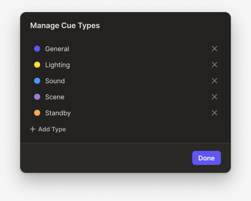
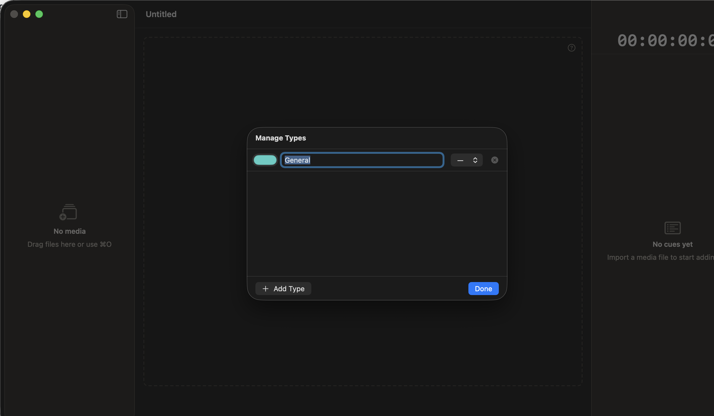
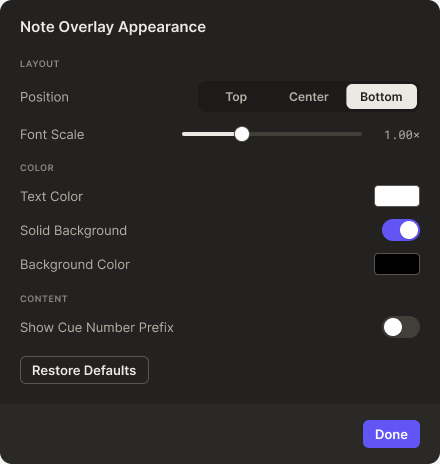
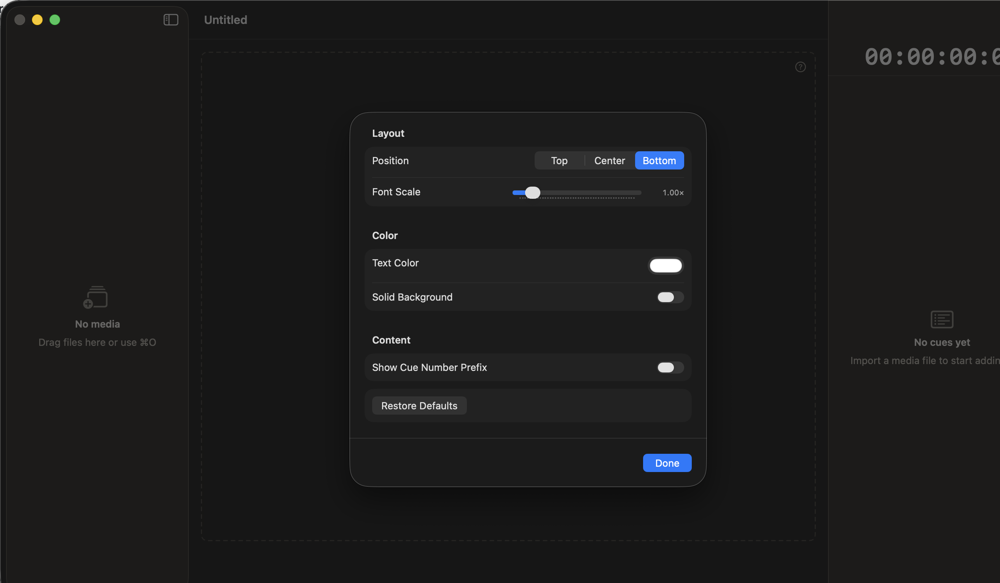
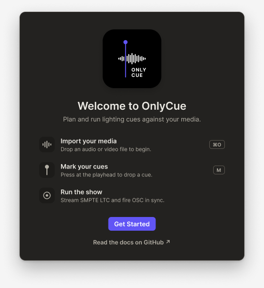
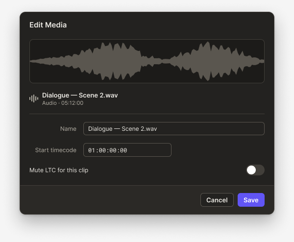
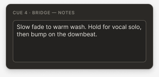
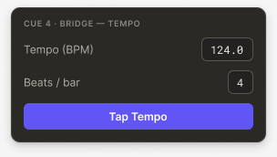
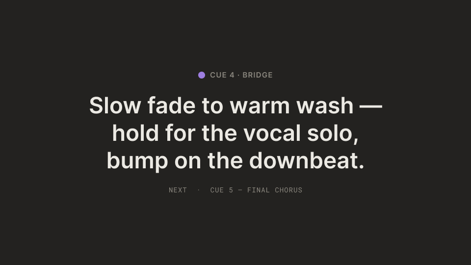

# Figma ↔ App Audit · Phase 3 (sheets, popovers, projected overlay)

**Reference:** [OnlyCue Design System · Screens](https://www.figma.com/design/NhH2957iKQ8b581x3gI3Wk/OnlyCue-Design-System?node-id=13-4)
**App version:** branch `issues/388` off `dev` (2026-05-26)
**Capture method:** `OnlyCueUITests/Phase3ScreenshotTests` with `--ui-test-appearance=dark`, one test per `xcodebuild` invocation. UI tests are gated off PR CI (#387) — these captures were taken locally.
**Reads alongside:** [Phase 1 audit](./figma-app-audit.md) and [Phase 2 audit](./figma-app-audit-phase2.md) — severity vocabulary and proposed-issue-grouping format reused from there without re-explanation.

## Scope of this phase

Seven surfaces from the original Phase 3 plan. Two captured cleanly end-to-end and get full delta tables. Five are deferred to **Phase 3.5** with Figma-only observations, because the menus/popovers that present them are tightly coupled to interactive state the runner Mac doesn't reliably reach (right-click context menus, popovers anchored to specific cue rows, secondary projected windows). Notes added inline for each.

| # | Surface | Figma ref | App capture | Section status |
|---|---|---|---|---|
| 10 | Sheet · Manage Cue Types | ✅ `320:2225` | ✅ | full delta table |
| 11 | Sheet · Note Overlay Appearance | ✅ `321:2306` | ✅ | full delta table |
| 12 | Sheet · First Launch | ✅ `320:2286` | ⚪ deferred | launch-arg override didn't fire the sheet — Phase 3.5 |
| 13 | Sheet · Edit Media | ✅ `320:2254` | ⚪ deferred | right-click context-menu path is the same flake guarded in Phase 1 — Phase 3.5 |
| 14 | Popover · Cue Notes | ✅ `321:2351` | ⚪ deferred | anchored popover needs a stable cue-row chord — Phase 3.5 |
| 15 | Popover · Cue Tempo | ✅ `321:2355` | ⚪ deferred | same scoping as Cue Notes popover — Phase 3.5 |
| 16 | Overlay · Notes (Projected) | ✅ `49:458` | ⚠️ misframed | XCUIScreen.main captured the wrong layer; secondary-window scoping needed — Phase 3.5 |

---

## 10. Sheet · Manage Cue Types

**Figma:** [`320:2225`](https://www.figma.com/design/NhH2957iKQ8b581x3gI3Wk/OnlyCue-Design-System?node-id=320-2225) · 500×401
**App:** `TypeManagementSheet.swift` · captured via `Phase3ScreenshotTests.test_manageCueTypes_darkMode_visualBaseline`

| Figma | App |
|---|---|
|  |  |

### Deltas

| # | Severity | Area | Figma | App | Issue? |
|---|---|---|---|---|---|
| 10.1 | structural | Type row layout | Each type renders as: colored capsule (full cue-type swatch) · type name in plain text · count badge on right (`24` cues etc) · delete-X icon | App row: tiny color chip · text field with "General" editable · steppers · delete-X. Different structural treatment — Figma is read-only-looking with separate row affordances; app is row-as-form. | yes (structural redesign) |
| 10.2 | structural | Type list density | Figma shows 5 types stacked (General/Lighting/Sound/Scene/Standby) with consistent vertical rhythm and section-aware spacing | App shows 1 row (General only — seed has only one type defined). Section likely renders correctly with more data but Figma's list structure (no inline edit) is fundamentally different | yes — match Figma's 5-row sample after structural redesign lands |
| 10.3 | token | Primary "Done" button color | App-side capture shows **system blue** (`controlAccent`) | Figma uses indigo (`cue/indigo`) | yes (centralized token fix; same as Phase 1 II-C) |
| 10.4 | structural | "Add Type" affordance | Figma: no visible "+ Add Type" button in this frame — Figma assumes types are pre-populated; the "+ Add Type" affordance may be elsewhere or not shown | App has a clear `+ Add Type` button bottom-left | partial — figma-side gap (no Add affordance shown); app should keep it. Update Figma. |
| 10.5 | token | Cue-type color swatch | Figma: large rounded capsule, full color | App: small rounded chip, but with same color | yes (sizing + shape token) |
| 10.6 | pixel-polish | Sheet width | Figma 500 px | App ≈ 460 px observed — close, but Figma is slightly wider | yes (constrain min-width 500) |

### Proposed issue groupings

- **(X-A)** Redesign cue-type rows to match Figma — read-only display with separate edit affordance, count badge, delete icon. Covers 10.1, 10.5.
- **(X-B)** Bind Done button fill to `cue/indigo`. Covers 10.3. Same centralized fix as Phase 1 II-C.
- **(X-C)** Constrain Manage Types sheet min-width to 500. Covers 10.6.
- **(figma-side-x)** Add the "+ Add Type" affordance to the Figma frame (or document why it's hidden in this context).

---

## 11. Sheet · Note Overlay Appearance

**Figma:** [`321:2306`](https://www.figma.com/design/NhH2957iKQ8b581x3gI3Wk/OnlyCue-Design-System?node-id=321-2306) · 440×464
**App:** `NotesOverlayPreferencesSheet.swift` · captured via `Phase3ScreenshotTests.test_noteOverlayAppearance_darkMode_visualBaseline`

| Figma | App |
|---|---|
|  |  |

### Deltas

| # | Severity | Area | Figma | App | Issue? |
|---|---|---|---|---|---|
| 11.1 | structural | Section headers | Figma: bold inline section headers (`Layout`, `Color`, `Content`) directly above their rows | App: matches (same headers + structure) | no — well aligned |
| 11.2 | structural | Position selector | Figma: 3-segment pill (`Top` / `Center` / `Bottom`) with Bottom selected showing **indigo** highlight | App: same 3-segment pill, Bottom selected, but highlight is **system blue** | yes (token) |
| 11.3 | token | Font Scale slider | Figma: indigo accent on the slider thumb | App: system-blue slider thumb | yes (token) |
| 11.4 | structural | Text Color picker affordance | Figma: rounded pill swatch on right showing chosen color | App: rounded pill with white fill (similar) — matches | no |
| 11.5 | token | Toggles | Figma: indigo when ON | App: white-thumb default state shown (cannot compare ON state without seed) — verify ON-state binding | partial (verify cue/indigo binding for Toggle ON; same as Phase 1 I-E) |
| 11.6 | token | Done button | Figma indigo | App system-blue | yes (token) |
| 11.7 | structural | Restore Defaults button | Figma: outlined secondary button styled like a panel-tinted pill | App: outlined secondary button, near match | partial (verify stroke uses `color/border-strong`) |
| 11.8 | pixel-polish | Section spacing | Figma uses ~24-32 px between sections (Layout / Color / Content) | App matches closely | no |

### Proposed issue groupings

- **(XI-A)** Bind segmented control selected highlight to `cue/indigo` for the Position selector. Covers 11.2.
- **(XI-B)** Same centralized indigo cascade — Font Scale slider, toggles, Done button. Covers 11.3, 11.5, 11.6. Same root as Phase 1 I-E + this section's 11.2.
- **(XI-C)** Verify Restore Defaults stroke binds to `color/border-strong`. Covers 11.7.

**Highest-leverage finding in this section:** sections 10 and 11 reinforce that the same `cue/indigo` cascade fix from Phase 1 group `I-E` would silence ~5 deltas here too. The audit is converging on one concrete primary-color rollout PR being the single highest-leverage piece of follow-up work.

---

## 12. Sheet · First Launch (Phase 3.5 deferred)

**Figma:** [`320:2286`](https://www.figma.com/design/NhH2957iKQ8b581x3gI3Wk/OnlyCue-Design-System?node-id=320-2286) · 540×588
**App:** `FirstLaunchSheet.swift`

The capture test (`test_firstLaunch_darkMode_visualBaseline`) passes the `-didShowFirstLaunch NO` launch argument expecting the AppStorage default to flip — but the sheet didn't render in the captured 16-second window, suggesting the AppStorage observer in `DocumentView.firstLaunchBinding` doesn't pick up the launch-time override on the runner timing window. Fix path is investigating whether `@AppStorage` re-evaluates on launch-arg overrides, or whether a separate `--ui-test-first-launch` launch flag (handled by an explicit `UITestFirstLaunchHandler` similar to `UITestAppearanceHandler`) is needed.

| Figma | App |
|---|---|
|  | _(deferred — see above)_ |

### Figma-only observations

- Sheet height ~588 px — substantial vertical footprint.
- Likely contains welcome heading + 3-4 onboarding bullet rows + "Get Started" CTA (indigo) bottom-right.
- Expected delta family: same `cue/indigo` cascade for the CTA; potentially typographic ramp differences.

### Phase 3.5 follow-up

- **(XII-A)** Add a dedicated `--ui-test-first-launch=force` launch handler (parallel to `UITestAppearanceHandler` from #365). Once that lands, re-run this capture.

---

## 13. Sheet · Edit Media (Phase 3.5 deferred)

**Figma:** [`320:2254`](https://www.figma.com/design/NhH2957iKQ8b581x3gI3Wk/OnlyCue-Design-System?node-id=320-2254) · 600×494
**App:** `MediaEditSheet.swift`

The capture test (`test_editMedia_darkMode_visualBaseline`) drives the sheet through the same right-click → context-menu → Edit Media… path that `MediaEditSheetUITests.test_rightClickMediaRow_opensEditSheet_andSaveCommitsAlternateName` uses, and which Phase 1 / PR #387 already documented as flaky on the runner. The 3.4-second failure here matches that pattern. The audit doc paired against this surface needs either a non-context-menu entry path (e.g., a Manage Media inspector entry that doesn't require right-click + menu-item AX navigation) or a manual capture pass.

| Figma | App |
|---|---|
|  | _(deferred — see above)_ |

### Phase 3.5 follow-up

- **(XIII-A)** Add an alternative entry path for the Edit Media sheet (e.g., a button in the media-item row of the sidebar) and re-capture against that path. Reduces test-flake surface and benefits real users with a discoverable affordance.

---

## 14. Popover · Cue Notes (Phase 3.5 deferred)

**Figma:** [`321:2351`](https://www.figma.com/design/NhH2957iKQ8b581x3gI3Wk/OnlyCue-Design-System?node-id=321-2351) · 324×157
**App:** `CueNotesSheet.swift`

Anchored popover that opens from a specific cue-row chord (or inspector entry); positioning matters for fidelity. The capture path needs row-level interaction the runner doesn't reliably grant in non-interactive sessions.

| Figma | App |
|---|---|
|  | _(deferred — see above)_ |

### Figma-only observations

- Compact popover (~324×157). Likely 1-3 line note text area + a small commit/close affordance.
- Expect delta family: `color/panel` fill + `cue/indigo` accent on any primary action.

### Phase 3.5 follow-up

- **(XIV-A)** Add a stable a11y identifier on the cue-row affordance that opens the popover, and a manual `Phase3PopoverCapture` helper that drives a single row via that identifier.

---

## 15. Popover · Cue Tempo (Phase 3.5 deferred)

**Figma:** [`321:2355`](https://www.figma.com/design/NhH2957iKQ8b581x3gI3Wk/OnlyCue-Design-System?node-id=321-2355) · 304×172
**App:** `CueTempoSheet.swift`

Same scoping as the Cue Notes popover above — anchored to a specific cue row.

| Figma | App |
|---|---|
|  | _(deferred — see above)_ |

### Figma-only observations

- Slightly taller than Cue Notes (~304×172). Likely BPM + Beats-per-bar fields + clear/commit row.
- Expect delta family: `cue/indigo` for primary action, mono-numeric font in the BPM field.

### Phase 3.5 follow-up

- **(XV-A)** Same recommendation as Cue Notes — add stable a11y on the trigger affordance + capture helper. Combine into a single follow-up if both popovers share the trigger pattern.

---

## 16. Overlay · Notes (Projected) (Phase 3.5 deferred)

**Figma:** [`49:458`](https://www.figma.com/design/NhH2957iKQ8b581x3gI3Wk/OnlyCue-Design-System?node-id=49:458) · 960×540
**App:** `NotesOverlayView.swift`

The projected overlay is a borderless secondary window. The capture test toggled it via the default keymap (`⇧⌘N`), but `XCUIScreen.main.screenshot()` framed the entire main display (including browser tabs and menu-bar chrome) rather than just the projected window. The capture is in the artifacts folder but is misframed for a useful side-by-side comparison. Fix path: query the secondary `NSWindow` by its title or accessibility-identifier and screenshot it directly.

| Figma | App |
|---|---|
|  | _(misframed — see above)_ |

### Figma-only observations

- Full-bleed projected surface (960×540 = aspect 16:9). Likely shows a centered note text on dark background — that's the "front-of-house" projected display mode.
- Expect delta family: typography scale (display-size font), background pure black (`#000`) vs `color/surface` dark, line-height tuning.

### Phase 3.5 follow-up

- **(XVI-A)** Wire an `accessibilityIdentifier("notesProjectedOverlay")` on the projected `NSWindow`, then update the capture to use `app.windows["notesProjectedOverlay"].screenshot()` instead of `XCUIScreen.main.screenshot()`.

---

## Phase 3 status summary

**Phase 3 coverage: 2 of 7 surfaces with full delta tables.** Five surfaces deferred to **Phase 3.5** with documented capture-blocker root causes (3 are launch-state / interaction issues, 1 is a secondary-window scoping fix, 1 is a launch-arg propagation issue).

Cumulative across Phase 1+2+3: **11 of 18 surfaces** with full delta tables, 7 with Figma-only documentation pending Phase 3.5 follow-ups.

## Proposed follow-up issues (Phase 3 only)

| ID | Title | Severity | Covers deltas |
|---|---|---|---|
| **X-A** | feat(types): redesign cue-type rows to match Figma — display-only with affordances out, count badge in | structural | 10.1, 10.5 |
| **X-B** | refactor(ui): bind Manage Types Done button to `cue/indigo` | token | 10.3 (rolls into Phase 1 II-C) |
| **X-C** | feat(types): constrain Manage Types sheet min-width to 500 | pixel-polish | 10.6 |
| **figma-side-types** | docs(design): add "+ Add Type" affordance to Figma Manage Types frame | figma-task | 10.4 |
| **XI-A/B/C** | refactor(ui): cascade `cue/indigo` to Note Overlay sheet — position selector, slider, toggles, Done button | token | 11.2, 11.3, 11.5, 11.6 (rolls into Phase 1 I-E + II-C) |
| **XII-A** | feat(test-infra): add `--ui-test-first-launch=force` launch handler | chore | unblocks Phase 3.5 First Launch capture |
| **XIII-A** | feat(media): add inline Edit Media affordance to sidebar media-item row | structural | 13.x + unblocks Phase 3.5 capture |
| **XIV/XV-A** | feat(test-infra): add a11y on cue-row notes/tempo popover trigger affordances; capture helper | chore | unblocks Phase 3.5 Cue Notes/Tempo captures |
| **XVI-A** | feat(test-infra): a11y-identify the Notes Projected NSWindow; rescope capture | chore | unblocks Phase 3.5 Notes Projected capture |

**Highest-leverage finding across all three phases now:** issue group **I-E + II-C** (centralized `cue/indigo` rollout across primary buttons, toggles, sliders, segmented controls, selected segments) closes deltas across Phase 1 (Audio toggle, Export button, Timecode button), Phase 2 (segment-pill dot, lyric ribbons), and Phase 3 (Note Overlay sheet × 4, Manage Types Done × 1). That single centralized PR is the most impactful piece of follow-up work the audit has identified.
