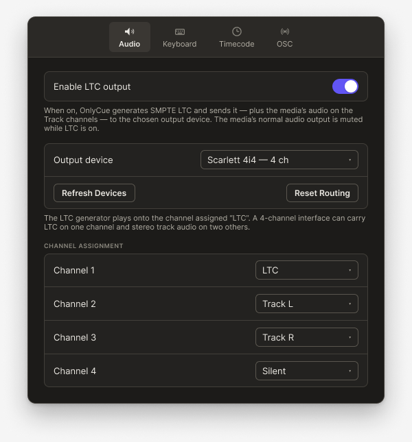
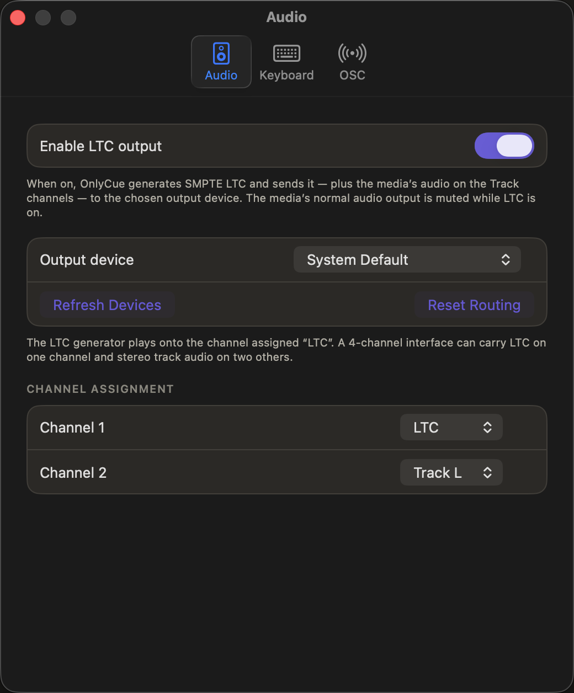
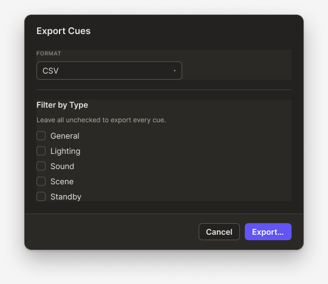
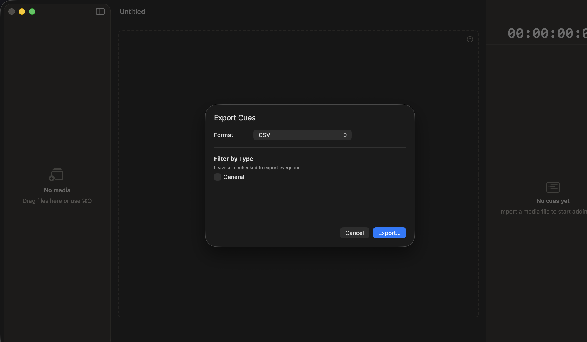
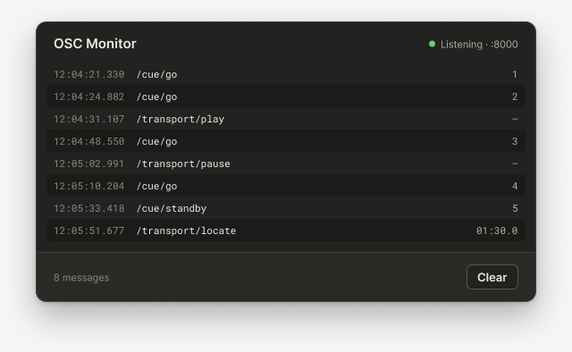
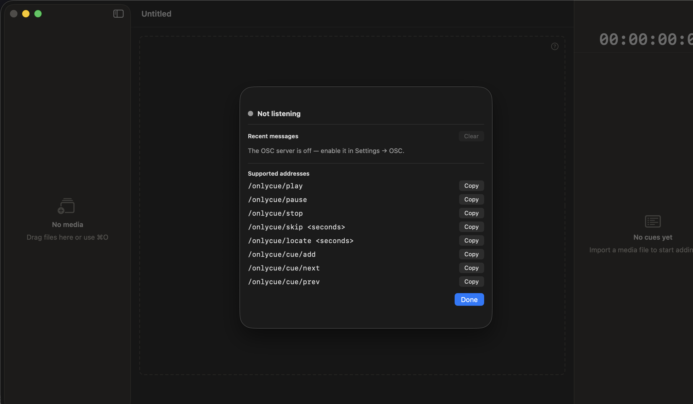
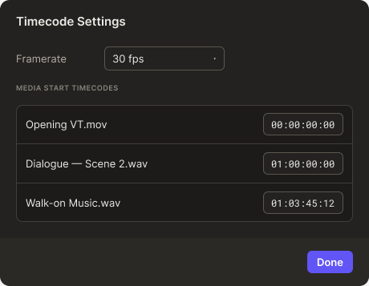
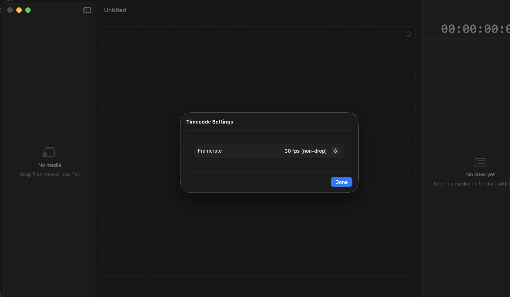
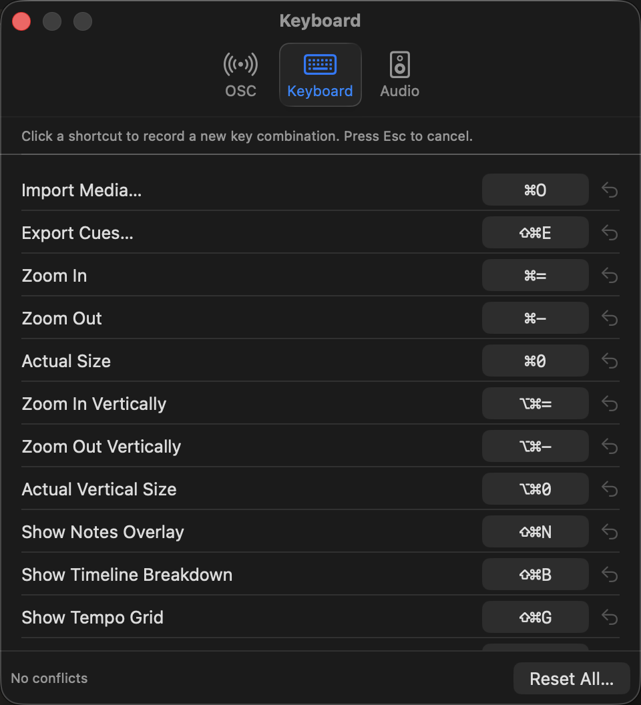

# Figma ↔ App Audit (Dark Mode)

**Reference:** [OnlyCue Design System · Screens](https://www.figma.com/design/NhH2957iKQ8b581x3gI3Wk/OnlyCue-Design-System?node-id=13-4)
**App version:** branch `dev` @ `c164ec8` (2026-05-24)
**Capture method:** XCUITest screenshot harness (`OnlyCueUITests/*ScreenshotTests.swift`) with `--ui-test-appearance=dark`. Figma side via Figma MCP `get_screenshot`.

## How to read this doc

Each surface has:

- **Figma reference** + **App actual** screenshots, captured at the same point in time.
- A **delta table** with one row per visible difference.
- **Severity**: `structural` (layout / missing element / wrong component) · `pixel-polish` (spacing, radii, weights ≤2px) · `token` (color/typography token mis-applied or missing) · `state` (correct chrome, wrong content state — usually a seed issue, lowest priority).
- **Issue?**: which deltas should become a GitHub issue. State-only deltas usually don't.

The match bar is **pixel-level**: every visible difference is in scope. State-only mismatches are listed but flagged as test-fixture rather than UI bugs.

---

## 1. Settings · Audio

**Figma:** [`321:2200`](https://www.figma.com/design/NhH2957iKQ8b581x3gI3Wk/OnlyCue-Design-System?node-id=321-2200) · 600×645
**App:** `AudioSettingsView.swift` · captured via `AudioSettingsScreenshotTests.test_audioSettings_darkMode_visualBaseline`

| Figma | App |
|---|---|
|  |  |

### Deltas

| # | Severity | Area | Figma | App | Issue? |
|---|---|---|---|---|---|
| 1.1 | structural | Tab order | Audio → Keyboard → Timecode → OSC (left to right) | OSC → Keyboard → Audio (right to left, **Timecode tab absent**) | ✅ yes — missing Timecode tab + wrong order |
| 1.2 | structural | Tab item visual style | Custom dark pill with subtle elevation on selected; icon + label stacked, neutral white text on selected | Apple stock `NSToolbarItem` with system blue accent on selected (`Audio` text in blue, blue tinted icon) | ✅ yes — toolbar style does not match design |
| 1.3 | token | Selected tab color | neutral (`color/text-primary` ≈ `#ebe9e3`) | system `controlAccent` (Apple blue `#0a84ff`) | ✅ yes — should use `color/text-primary` not system accent |
| 1.4 | structural | Content containment | Each section sits inside a rounded "panel" card (`color/panel` fill, ~12 px radius, 1 px `color/border` stroke) — visible around "Enable LTC output" row, "Output device" group, and the channel assignment list | Controls laid directly on the window background with no card containment — flat, no borders, no panel fill | ✅ yes — adopt panel-card pattern |
| 1.5 | pixel-polish | Window padding | ~24 px outer padding around content | ~32 px outer padding (left/right asymmetric — extra space on right) | ✅ yes — tighten and balance |
| 1.6 | pixel-polish | Window width | 600 px | ~916 px (significantly wider than reference) | ✅ yes — constrain default width to match design |
| 1.7 | token | Description text color | `color/text-secondary` (~`#b3afa5`) | Looks like `secondaryLabelColor` (slightly more grey, less warm) | ✅ yes — bind to `color/text-secondary` token |
| 1.8 | state | LTC enabled state | Toggle ON, output device + channel assignment visible | Toggle OFF, lower content hidden | ⚠️ test-fixture — add a second capture seeded with `LTCRouting.isEnabled = true` for full comparison |
| 1.9 | pixel-polish | Toggle visual | Custom indigo (`cue/indigo` ≈ `#5b5bd6`) | System accent blue | ✅ yes — toggle ON-state should be brand indigo (already implemented in some surfaces — verify token binding here) |
| 1.10 | structural | Window chrome | Single close button only (no minimize/zoom), shown top-left | Standard three-button traffic light (red/yellow/grey) | ⚠️ macOS-conventional — recommend KEEPING app behavior; update Figma to show full traffic light. Not an issue. |

### Proposed issue groupings (for `/gh-issue` later)

- **(I-A)** Settings toolbar redesign — tab order, custom pill style, Timecode tab restoration, neutral selection color. Covers 1.1, 1.2, 1.3.
- **(I-B)** Settings panel-card containment — apply card pattern to Settings groups. Covers 1.4.
- **(I-C)** Settings window size + padding — constrain width to 600, balance padding to 24 px. Covers 1.5, 1.6.
- **(I-D)** Settings text token audit — bind secondary text to `color/text-secondary`. Covers 1.7.
- **(I-E)** Settings toggle indigo binding — verify `cue/indigo` token applied. Covers 1.9.
- **(test-fixture)** Add LTC-enabled dark capture variant. Covers 1.8.
- **(figma-side)** Update Figma to show three-button window chrome. Covers 1.10.

---

## 2. Sheet · Export Cues

**Figma:** [`320:2193`](https://www.figma.com/design/NhH2957iKQ8b581x3gI3Wk/OnlyCue-Design-System?node-id=320-2193) · 540×467
**App:** `ExportSheet.swift` · captured via `ExportSheetScreenshotTests.test_exportSheet_darkMode_visualBaseline`

| Figma | App |
|---|---|
|  |  |

### Deltas

| # | Severity | Area | Figma | App | Issue? |
|---|---|---|---|---|---|
| 2.1 | structural | Format selector | Sectioned card: "FORMAT" caption (uppercase, `color/text-tertiary`) above a full-width inset row containing a single "CSV" dropdown filling the row | Inline `LabeledContent`-style row: "Format" label on the left, compact "CSV" popup on the right — no caption-and-card grouping | yes |
| 2.2 | structural | Type filter list | Sectioned card titled **"Filter by Type"** (bold), helper text "Leave all unchecked to export every cue." below the title, then a single-column list of all 5 types (General, Lighting, Sound, Scene, Standby) each with a labelled checkbox | App only shows **"General"** (single checkbox visible) — the other type rows are missing entirely from the rendered sheet | yes |
| 2.3 | token | Sheet background panel | Distinct `color/panel` fill (≈`#2b2926`) with 12 px corner radius and 1 px `color/border` stroke; clearly elevated over the document window | App sheet has slight panel fill but no visible stroke; corners present but less defined | yes (border-stroke missing) |
| 2.4 | token | Primary action color | Indigo (`cue/indigo` ≈ `#5b5bd6`) on "Export…" button — brand primary | System blue (`controlAccent` ≈ `#0a84ff`) on "Export…" button | yes — must adopt `cue/indigo` |
| 2.5 | pixel-polish | Action row separator | A 1 px `color/border` divider sits above the Cancel/Export row, visually separating the form from the actions | App has no separator above the action row | yes |
| 2.6 | pixel-polish | Sheet width | 460 px | ≈ 430 px (slightly narrower) — controls feel cramped because content didn't auto-fit | yes (constrain to 460 min-width) |
| 2.7 | structural | Helper text placement | "Leave all unchecked to export every cue." sits between the section title and the first checkbox — clearly part of the Filter-by-Type explanation | App has no equivalent helper text visible | yes (add helper copy) |
| 2.8 | state | Background document state | Background shows empty waveform editor with "Untitled" doc title and right-side cue panel | Matches | no |

### Proposed issue groupings

- **(II-A)** Export sheet card-style sections — wrap Format and Filter-by-Type groups in `color/panel` cards with section captions. Covers 2.1, 2.3, 2.5.
- **(II-B)** Render every cue type in the filter list, not just "General". Covers 2.2 — likely a `ForEach` source mismatch in `ExportSheet.swift`.
- **(II-C)** Bind primary export button fill to `cue/indigo`. Covers 2.4. Same root issue as 1.9 (toggle) and Primary button audit from the prior design-system pass — may be the centralized fix.
- **(II-D)** Restore helper text "Leave all unchecked to export every cue." under the Filter-by-Type heading. Covers 2.7.
- **(II-E)** Constrain Export sheet minimum width to 460. Covers 2.6.

---

## 3. Sheet · OSC Monitor

**Figma:** [`320:2346`](https://www.figma.com/design/NhH2957iKQ8b581x3gI3Wk/OnlyCue-Design-System?node-id=320-2346) · 640×394
**App:** `OSCMonitorView.swift` · captured via `OSCMonitorScreenshotTests.test_oscMonitor_darkMode_visualBaseline`

| Figma | App |
|---|---|
|  |  |

### Deltas

| # | Severity | Area | Figma | App | Issue? |
|---|---|---|---|---|---|
| 3.1 | structural | Header status | Top-right shows green status dot + `Listening · :8000` (live connection indicator with port) | Top shows grey status dot + "Not listening" — and there is no port readout | yes (when server is on, show port; when off, current copy is fine but dot color should be subdued grey not the same hue as ON state) |
| 3.2 | structural | Section layout | Single scrollable list of timestamped OSC messages, columns: time · address · value/count, mono font, alternating row tint | Two sections stacked: **Recent messages** (with a hidden message because server is off) + **Supported addresses** (the contract list with Copy buttons per row) — completely different IA | yes — the Figma reference shows ONE primary surface (live log); the app collapses two responsibilities (log + reference) into one sheet |
| 3.3 | token | Action button | Bottom-right "Clear" — outlined secondary button (`color/border` stroke, no fill) | "Done" — solid system-blue primary button | yes (button role mismatch + token mismatch) |
| 3.4 | structural | Footer summary | "8 messages" caption bottom-left, mirrors row count | No row-count caption | yes (small addition) |
| 3.5 | token | Row background | Alternating subtle stripe — `color/surface-sunken` for stripes, `color/panel` for the panel | App rows are uniform `color/panel`, no zebra striping | yes |
| 3.6 | pixel-polish | Mono numeric font | Time column uses mono with consistent width across rows; counts right-aligned | App uses mono but spacing/padding looks less tight; right alignment present | yes (minor) |
| 3.7 | state | Listening | Figma shows server enabled state (green dot, port, message history) | App captured in disabled state (server off) — produces useful contrast but section 3.1 still needs both states verified | partial (test fixture) |

### Proposed issue groupings

- **(III-A)** OSC Monitor IA: collapse "Supported addresses" sub-section out of this sheet (move to a separate "OSC Help" link in Settings → OSC) so the monitor is a single-purpose live log matching Figma. Covers 3.2.
- **(III-B)** Add header status badge with green dot + "Listening · :PORT" when server is on; preserve "Not listening" copy in disabled state but use a more subdued grey dot. Covers 3.1.
- **(III-C)** Add row-count footer summary "{N} messages". Covers 3.4.
- **(III-D)** Convert "Done" to outlined "Clear" secondary button (clears log; sheet stays open) per Figma. Adopt `cue/indigo` only if a future explicit primary action is added. Covers 3.3.
- **(III-E)** Add zebra striping to message rows using `color/surface-sunken`. Covers 3.5.
- **(test-fixture)** Add a seeded server-on capture variant. Covers 3.7.

---

## 4. Sheet · Timecode Settings

**Figma:** [`321:2279`](https://www.figma.com/design/NhH2957iKQ8b581x3gI3Wk/OnlyCue-Design-System?node-id=321-2279) · 460×357
**App:** `TimecodeSettingsSheet.swift` · captured via `TimecodeSettingsSheetScreenshotTests.test_timecodeSettings_darkMode_visualBaseline`

| Figma | App |
|---|---|
|  |  |

### Deltas

| # | Severity | Area | Figma | App | Issue? |
|---|---|---|---|---|---|
| 4.1 | structural | Framerate row layout | Plain row: label "Framerate" left, dropdown showing "30 fps" right — value reads `30 fps`, not `30 fps (non-drop)` | Same layout, but value reads `30 fps (non-drop)` — semantically richer string | partial — semantics are right in the app, but Figma is the canonical reference. Recommend keeping `30 fps (non-drop)` in app and **updating Figma** to match. Track as a Figma-side correction. |
| 4.2 | structural | "Media start timecodes" section | Dedicated section: caption `MEDIA START TIMECODES` (uppercase, `color/text-tertiary`) above a card listing 3 media items (`Opening VT.mov`, `Dialogue — Scene 2.wav`, `Walk-on Music.wav`) each with a monospace timecode field | App **does not show this section at all** — there is no media in the captured document; section would only appear with imported media | yes (missing without media) — but verify the section renders when media is present. If not, that's the real bug. |
| 4.3 | token | Primary action color | Indigo `cue/indigo` on "Done" button | System blue `controlAccent` on "Done" button | yes (same as 1.9, 2.4 — central fix) |
| 4.4 | pixel-polish | Sheet width | 460 px (with timecode list section visible at full content height) | ≈ 380 px observed — narrower than Figma; the Framerate row is centered but the sheet itself feels compressed | yes (constrain min width to 460) |
| 4.5 | structural | Section separation | 1 px `color/border` divider sits between Framerate row and the timecode list / above the action row | App has implicit divider only above action row; no inter-section divider (because no second section is shown) | partial — re-evaluate once 4.2 is fixed |

### Proposed issue groupings

- **(IV-A)** Add `MEDIA START TIMECODES` section to `TimecodeSettingsSheet` when at least one media item is imported. Covers 4.2 and re-validates 4.5.
- **(IV-B)** Bind primary Done button fill to `cue/indigo` (likely centralized fix via the Button component). Covers 4.3.
- **(IV-C)** Constrain Timecode sheet min width to 460. Covers 4.4.
- **(figma-side)** Update Figma framerate value to `30 fps (non-drop)` to match canonical app vocabulary. Covers 4.1.

---

## 5. Settings · Keyboard (app-only baseline)

**Figma:** No dedicated dark-mode frame in the OnlyCue Design System file for the Keyboard pane. This section is an **app-only baseline** so it can be compared once a Figma reference is authored.
**App:** `KeyboardSettingsView.swift` · captured via `KeyboardSettingsScreenshotTests.test_keyboardSettings_darkMode_visualBaseline`

| Figma | App |
|---|---|
| _(no reference yet)_ |  |

### Observations (no deltas yet)

- App uses the same Apple stock `NSToolbarItem` Settings toolbar as the Audio pane (delta 1.2 applies here too — system blue accent on selected tab; should match the design-system pill style once 1.2's fix lands).
- Each shortcut row is a clean `HStack` with label left, key-cap on the right, and a revert affordance further right. Key-caps use a dark capsule (`color/panel`) with a 1 px stroke — visually consistent with what Figma uses for inline code/key tokens elsewhere.
- "No conflicts" status caption + "Reset All…" secondary button at the bottom is well-aligned with the design-system footer pattern used in Audio Settings (1.x section).
- **Open question:** macOS HIG vs OnlyCue design-system style for the keymap table — the app currently uses sentence-case action names; Figma typically uses sentence-case so we're aligned. The key-cap rendering (e.g. `⇧⌘E`) is mono and looks correct.

### Recommended follow-up

- **(V-A)** Author a Figma frame for Settings → Keyboard in dark mode, then re-audit. Track as a Figma-side deliverable (no app change yet).
- The toolbar fix from issue group **I-A** will land here automatically.

---

## Phase 1 status summary

| # | Surface | Figma ref | App capture | Section status |
|---|---|---|---|---|
| 1 | Settings · Audio | ✅ `321:2200` | ✅ | full delta table |
| 2 | Sheet · Export Cues | ✅ `320:2193` | ✅ | full delta table |
| 3 | Sheet · OSC Monitor | ✅ `320:2346` | ✅ | full delta table |
| 4 | Sheet · Timecode Settings | ✅ `321:2279` | ✅ | full delta table |
| 5 | Settings · Keyboard | ❌ none | ✅ | app-only baseline |

**Phase 1 coverage: 5/18 surfaces.** Remaining 13 surfaces (DocumentView × 6 modes, sheet · Manage Cue Types, sheet · Edit Media, sheet · First Launch, sheet · Note Overlay Appearance, popover · Cue Notes, popover · Cue Tempo, overlay · Notes Projected, overlay · Lyrics Projected) are scheduled for Phase 2 and 3 — see this issue's body for the schedule.

## Proposed follow-up issues (Phase 1 only)

When this audit PR lands, file these as individual issues via `/gh-issue`. Severity reflects impact on visual fidelity, not implementation difficulty.

| ID | Title | Severity | Covers deltas |
|---|---|---|---|
| **I-A** | feat(settings): redesign settings toolbar to custom dark pill style with all 4 tabs (Audio, Keyboard, Timecode, OSC) in canonical order | structural | 1.1, 1.2, 1.3 |
| **I-B** | feat(settings): wrap audio settings groups in panel cards | structural | 1.4 |
| **I-C** | feat(settings): constrain settings window width to 600 px with balanced 24 px padding | pixel-polish | 1.5, 1.6 |
| **I-D** | refactor(ui): bind secondary description text to `color/text-secondary` token across settings panes | token | 1.7 |
| **I-E** | refactor(ui): centralize toggle ON-state to `cue/indigo` via dedicated Toggle style | token | 1.9 (and reuse from prior session) |
| **II-A** | feat(export): adopt sectioned-card layout for Format + Filter-by-Type groups | structural | 2.1, 2.3, 2.5 |
| **II-B** | bug(export): render every cue type in filter list, not just General | structural | 2.2 |
| **II-C** | refactor(ui): bind primary action buttons (Export, Done, etc) to `cue/indigo` via centralized Button style | token | 2.4, 4.3 (cross-cuts III-D) |
| **II-D** | feat(export): restore helper copy under Filter-by-Type heading | pixel-polish | 2.7 |
| **II-E** | feat(export): constrain export sheet minimum width to 460 px | pixel-polish | 2.6 |
| **III-A** | refactor(osc): collapse Supported addresses out of OSC Monitor; move to Settings → OSC help | structural | 3.2 |
| **III-B** | feat(osc): add header status badge with port readout when listening | structural | 3.1 |
| **III-C** | feat(osc): add row-count footer summary to OSC Monitor | pixel-polish | 3.4 |
| **III-D** | refactor(osc): convert OSC Monitor Done button to outlined Clear (secondary role) | token | 3.3 |
| **III-E** | feat(osc): add zebra striping to OSC Monitor message rows | token | 3.5 |
| **IV-A** | feat(timecode): show Media Start Timecodes section when media is present in Timecode Settings | structural | 4.2 |
| **IV-C** | feat(timecode): constrain timecode settings sheet minimum width to 460 px | pixel-polish | 4.4 |
| **figma-side-x** | docs(design): update Figma references to match canonical app strings (e.g., `30 fps (non-drop)`) and full window chrome | figma-task | 1.10, 4.1 |

---

<!-- Phase 2 (DocumentView mode variants) and Phase 3 (new harness surfaces) to be added in follow-up PRs -->
